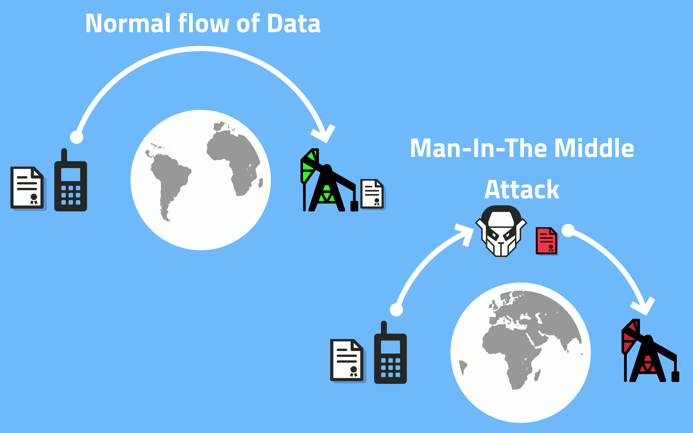

On Monday, Bleeping Computer published an article about the disturbing revelation that Dark Matter, a cybersecurity firm based in the United Arab Emirates, has aspirations to become a trusted root certificate authority in one of the world’s most popular web browsers.

A certificate authority (CA) plays an important role in the public key infrastructure (PKI) which ensures secure communication over the internet. CAs are trusted entities that manage, issue and sign digital security certificates that are relied on by the public in order to use the internet safely and securely. For this reason, it is imperative that users of the internet be able to trust the CAs themselves. Holders of root certificates must have the highest level of trust because they have the power to delegate this signing authority to others.

DarkMatter describes itself as a firm tasked with setting up and operating the UAE National PKI. However, the firm has also been known to engage in the [surveillance](https://www.reuters.com/investigates/special-report/usa-spying-raven/) of US citizens and those critical of the UAE monarchy.

Despite these accusations, DarkMatter still managed to obtain an intermediate certificate with full authority that is accepted by all major browsers, operating systems, and smart devices including many connected industrial facilities. Additionally, in December of 2017, DarkMatter formally submitted a request to become a [root certificate authority](https://bugzilla.mozilla.org/show_bug.cgi?id=1427262) in Firefox.

> Any of the dozens of certificate authorities trusted by your browser could secretly issue a fraudulent certificate for any website. A certificate authority (or other organization, such as a government spy agency) could then use the fraudulent certificate to spy on your communications with that site, even if it is encrypted with HTTPS. <small>Free Software Foundation</small>

Reuters uncovered last month that DarkMatter has been running an extensive international espionage operation called [Project Raven](https://www.reuters.com/investigates/special-report/usa-spying-raven/) to spy on human rights activists, journalists and political rivals.

> When asked if adding DarkMatter as a trusted root CA would put them in a good position to perform cyber attacks, Rudenberg acknowledged that this is a valid concern not only for DarkMatter, but for all CAs. <small><a href="https://www.bleepingcomputer.com/news/security/cybersecurity-firm-darkmatter-request-to-be-trusted-root-ca-raises-concerns/">Bleepingcomputer.com</a></small>

The [Electronic Frontier Foundation](https://www.eff.org/deeplinks/2019/02/cyber-mercenary-groups-shouldnt-be-trusted-your-browser-or-anywhere-else) refers to DarkMatter as a “cyber-mercenary firm” and recommends that not only should its root certificate application be rejected but its existing intermediate certificate should be revoked.

Intermediate certificates, like the one DarkMatter was given, are a major source of concern in PKI. Even though browsers, operating systems and devices typically only use a small number of root certificates, a single root certificate can be used to create an infinite number of intermediate certificates which can then be used to falsely authenticate malicious software and websites.

[QuoVadis](https://www.quovadisglobal.com/),a swiss company that was recently [acquired by DigiCert](https://www.quovadisglobal.com/NewsAndEvents/20190117_Digicert_QuoVadis_Completion.aspx), was the root certificate authority that signed DarkMatter’s intermediate certificate effectively granting it the power to create certificates for any domain name at its discretion.

Users who could come in contact with malicious software and websites are not the only victims. Anyone relying upon QuoVadis certificates could be at risk as well. Some users have proposed deleting the QuoVadis root certificate from any installation to ensure that the DarkMatter certificates also become invalid. However, Protonmail a provider of VPN services and secure email, received its certificates from QuoVadis. As the company [pointed out](https://securityboulevard.com/2019/02/protonmail-ssl-certificates-and-darkmatter/) if any of their customers do this it would also disable their services as well.

What is perhaps most troubling is the lack of commentary around the repercussions these governance issues have for the rapidly growing internet of things (IoT) industry. IoT devices typically have limited computing power and most operate autonomously making them especially vulnerable to attack. Most connected devices do not have a way to check for certificate revocation. So even if the existing DarkMatter certificates are revoked, most connected devices will still not be safe.

To address these threats, Exosite, an industrial IoT platform has built the Diode technology stack for IoT devices. [Diode](https://diode.io), is a public blockchain that acts as a registry for certificates and authorities. It enables companies to comply with their local rules and regulations without the risk that their sensitive data can be intercepted and used against them by attackers or agents of hostile foreign powers.

To learn more join our [Telegram](https://t.me/diode_chain), follow us on [Twitter](https://twitter.com/diode_chain) and sign up for email notifications.
