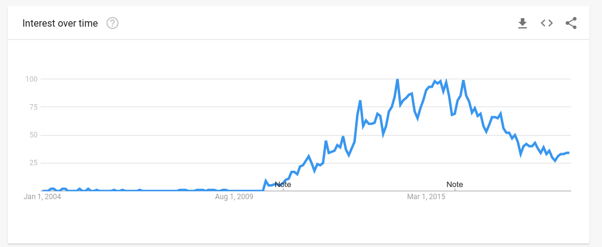
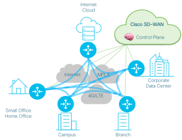
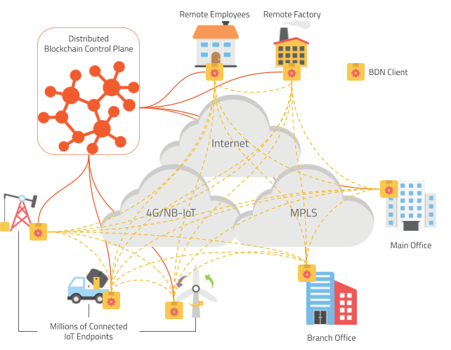

[Software Defined Networking](https://en.wikipedia.org/wiki/Software-defined_networking) (SDN) and [Network virtualization](https://en.wikipedia.org/wiki/Network_virtualization) have been the disruptor technologies that were fundamental to the success of Infrastructure as a Service (IaaS) providers such as Amazon AWS, Google Cloud Compute, and Azure during the last decade. Before that, there were plenty of rival cloud providers - for most of them, changing network configurations, adding/removing machines to a network required human interaction and would take hours or sometimes days. Dedicated networking, networking lines, and cables were key investments and skillsets maintained by these providers. A change in the network configuration would require a physical cable to change its place. However, manual labor also brings human errors, and often enough these physical changes were flawed.  Some issues would only show themselves in critical conditions - such as when a cold backup load-balancer would not be properly connected to its primary.

In the modern networks of the big cloud providers, all machines are physically interconnected. All the time. The decision of whether data can flow from one machine to another is purely administered in software. While there are many open and known implementations of SDNs and Network virtualization, the big cloud providers keep their own implementations closely held secrets. The competitive advantage of the integrated systems is too big to share freely. To the detriment of the rest of the industry, SDN development has to be done without the help of the big cloud providers. The result is a fragmented marketplace with entrants from Cisco Systems, Citrix, Ericsson, IBM, Juniper Networks and other organizations:

**OpenStack**. The open market has not been able to successfully compete with the vertical integration that the big three (Amazon, Google, Microsoft) are able to offer in their cloud offerings. The OpenStack initiative launched with much fanfare with the promise to integrate SDN technology into a fully open source ecosystem of [Software Defined Infrastructure](https://en.wikipedia.org/wiki/Software-defined_infrastructure), and hence to enable all hardware providers to compete. While it reached its highest popularity in 2015, it ultimately [failed in its mission to commoditize what AWS brought to cloud computing ](https://www.packet.com/blog/how-we-failed-at-openstack/)

**SD-WAN.** Although the adoption of SDNs has mostly stayed within the big data center providers, and within some enterprise use cases, the technology has been able to develop further. The concept of Software Defined Wide Area Networks (SD-WAN) is a relatively recent idea using the same building blocks to create networks that span geographies to include branch-offices in remote areas. The enablers for SD-WAN are usually SD-WAN enabled network routers that connect whole subnets to each other. 

{: .pull-right }

This deployment though means that there must be a minimum critical mass for a remote location to cost-efficiently added to an SD-WAN. 

Software Defined Networks are defined by two attributes:

**1. Separation of control and data plane**. The separation of the control and data planes means that the intelligence of where the data is routed is split out from data itself, and placed on a separate control plane. This allows the routing to change without applications needing to adopt.

**2. Programmability**. This refers to the ability to make changes to the network configuration and add/remove new endpoints and application links during the runtime of the network. This includes the ability to change traffic flows and set Quality of Service (QoS) rules.

**BDN.** Blockchain Defined Networks (BDN), are a new class of software-defined networks that belong to this taxonomy. BDNs use the blockchain itself as a separate control plane, and use smart-contracts for programmability. Blockchain technology is by design slow to write, but scales extremely well on reads. Every write operation is validated through secure consensus checks until the whole network agrees on the changes. But once the changes are transactionally committed all network participants have immediate and fast read access to it. These attributes of blockchain lend themselves perfectly to the use case as the control plane for networks. 

**BDN-IoT.** The Internet of Things can improve business efficiencies and open completely new markets. The traditional approach of connecting device by device as independent internet endpoints creates an administrative burden. Embedding all these new endpoints into an existing SD-WAN infrastructure is not feasible at scale. Currently, scaled deployments require either to contract out the maintenance of IoT fleets, or to build an IoT-Platform approach internally.  In both cases, this leads to heterogeneous networks that lack integration, security, or both. With BDNs the rules of the game are changed. Blockchain is not only a transactional medium, but also brings smart-contracts. Defining IoT Fleets and their network governance in a smart-contract is the stepping stone for Blockchain Defined Networks for IoT (BDN-IoT).

Configuring millions of IoT endpoints into a single network is not a problem anymore. The theoretical storage limit of an Ethereum smart-contract is 2^256 keys. Enough to give each atom in the universe a label, and enough for any sized BDN-IoT definition. While the whole configuration can be huge, individual devices connected only ever need to fetch relevant fractions. [Merkle trees](https://blog.ethereum.org/2015/11/15/merkling-in-ethereum/) employed to store smart-contracts allow clients to fetch only individual bits of configuration while providing a proof of authenticity that these bits are in fact part of the overall authoritative configuration of the whole BDN.

**No-SPOF.** One major benefit blockchain-as-control-plane has over other technology is that it does not have a single-point-of-failure (SPOF). While traditional centrally configured networks become more brittle with size, the opposite is true for blockchain networks. Each added node is increasing the strength of its consensus. This allows BDNs to scale to many more, even millions of independent networks participants. Even when networks are split, the individual subnets can keep operating, and once networks are repaired the blockchain automatically repairs itself to a single chain using the builtin consensus mechanism. 

**No-Ops.** Blockchain brought a separation between "miners,” who operate the computational resources that the network is running on, and the users, who deploy smart-contracts, [decentralized applications](https://en.wikipedia.org/wiki/Decentralized_application) (Dapps) or just transact value. For an enterprise considering to adopt an SDN solution, this means that operational personnel, backup strategies, and other traditional IT tooling are not required parts of the system that needs to be established. Instead, the company can focus on its business requirements and formulate those in smart-contracts. This is a shift in the industry that follows the footsteps of the cloud providers, splitting the responsibility between operating a cloud and defining application logic. The opportunity to simplify operations is big, but requires change. Companies need to acquire new skills around smart-contract design and transform responsibility of current IT teams.

**Summary**. For many applications, the introduction of blockchain technology provides the potential for improvements.  But, in a few applications, like SDN deployments with growing IoT fleets, the advantages are game-changing. Today, Diode is the only IoT-Blockchain organization working on this new technology trend - we’re excited to be at the front end of what we are certain will become a large and vibrant market sector in the near future. 

<table>
<tr>
 <th></th>
 <th>SDN / SD-WAN</th>
 <th>BDN / BDN-IoT</th>
</tr>
<tr>
 <th>Separation of Control Plane</th>
 <td class="green">Yes</td>
 <td class="green">Yes</td>
</tr>
<tr>
 <th>Programmability</th>
 <td class="yellow"><a href="https://www.cisco.com/c/dam/en_us/solutions/industries/docs/gov/software_defined_networking.pdf">Limited, per Controller</a></td>
 <td class="green">Global Smart-Contract Programming Language</td>
</tr>
<tr>
 <th>Scalability</th>
 <td class="yellow">Limited, 100s of Sites</td>
 <td class="green">Yes, >1,000,000s of Sites</td>
</tr>
<tr>
 <th>No Point of Failure</th>
 <td class="red">No, need active/active or other failover strategies.</td>
 <td class="green">Yes, </td>
</tr>
<tr>
 <th>Automatic Repair, after network split</th>
 <td class="red">No</td>
 <td class="green">Yes</td>
</tr>
<tr>
 <th>No-Ops</th>
 <td class="red">No, requires dedicated, vendor trained teams.</td>
 <td class="green">Yes</td>
</tr>
</table>

If you're interested to learn more about this exciting development, or if you are an enterprise using SD-WANs and are looking for ways to extend them to your IoT fleet, follow us on [Twitter](https://twitter.com/diode_chain) or signup for our newsletter and we'll keep you up-to-date.

If you're a supplier of SDN or SD-WAN solutions, and would like to reach out to us for partnerships and cooperation, feel free to reach out to us directly at [partner@diode.io](mailto:partner@diode.io) or join the conversation on [Telegram](https://t.me/diode_chain).

---

**Sources**

[https://en.wikipedia.org/wiki/Software-defined_networking](https://en.wikipedia.org/wiki/Software-defined_networking)

[https://en.wikipedia.org/wiki/Network_virtualization](https://en.wikipedia.org/wiki/Network_virtualization)

[https://en.wikipedia.org/wiki/Software-defined_infrastructure](https://en.wikipedia.org/wiki/Software-defined_infrastructure)

[https://www.packet.com/blog/how-we-failed-at-openstack/](https://www.packet.com/blog/how-we-failed-at-openstack/)

[https://en.wikipedia.org/wiki/Decentralized_application](https://en.wikipedia.org/wiki/Decentralized_application)

[https://blog.ethereum.org/2015/11/15/merkling-in-ethereum/](https://blog.ethereum.org/2015/11/15/merkling-in-ethereum/)
