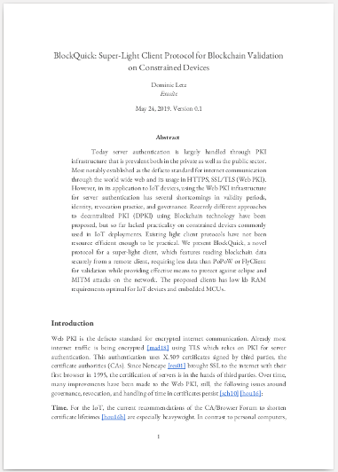

[- Click here if you just want to read the Paper -](https://eprint.iacr.org/2019/579.pdf)

In the last two posts of this series, we [first introduced the governance issues in PKI](/burning-platform-pki/why-there-are-3652-organizations-that-can-read-everyones-encrypted-traffic-19098/) and then the circular dependency between establishing trust in PKI certificates and [establishing the current time on a connected device](/burning-platform-pki/why-we-cant-trust-network-time-19116/).

So let's break that circular dependency between time and trust. The difference between trusting a person/an entity and trusting data is key here. How can we establish trust in the data, specifically in the time information, without trusting the individual messenger of this data? This is, in fact, leads to the same problem that Satoshi Nakamoto set out to solve with bitcoin the first blockchain network. The term blockchain has become [rather muddy, but by convention, the property we're talking about is the trustless blockchain](https://hackernoon.com/decentralized-data-why-blockchain-is-meaningless-and-trustless-is-everything-318fd14d3827). Creating a public consensus of the current state of facts without trusting any individual. 

Conveniently for our quest to getting the current time without trusting anyone both trustless blockchains Bitcoin and Ethereum carry a timestamp in their block. So it seems as easy as that - if we can establish a connection to the blockchain consensus of either of these networks - we have established the current time - trustless! But...

## "Resource-Constrained Devices"

When HTC announced that their new Handheld [Exodus 1s will be running a full Bitcoin node](https://www.engadget.com/2019/05/11/htc-exodus-1s-blockchain-phone-node/) that immediately raised eyebrows. Running a full Bitcoin node at this time requires ~200gb of storage plenty of ram and constant data bandwidth of ~140mb a day. For Ethereum the situation is similar:

<table>
<tr>
 <th>Node Type
 </th>
 <th>Trust Model
 </th>
 <th>Sync Bandwidth
 </th>
 <th>Sync Duration
 </th>
</tr>
<tr>
 <th>geth --syncmode=full
 </th>
 <td>Decentralized
 </td>
 <td>~400GB
 </td>
 <td>days
 </td>
</tr>
<tr>
 <th>geth --syncmode=fast
 </th>
 <td>Decentralized
 </td>
 <td>~130GB
 </td>
 <td>hours
 </td>
</tr>
<tr>
 <th>geth --syncmode=light
 </th>
 <td>Decentralized
 </td>
 <td>~1.2GB
 </td>
 <td>minutes
 </td>
</tr>
</table>

**For just getting the current time loading 1.2gb of blockchain data seems a bit hefty**. Also, we're working mostly on low-end chips for small IoT products, such as an [ESP32](https://www.espressif.com/en/products/hardware/esp32/overview), [TI CC3220](http://www.ti.com/product/CC3220S), or a [LinkIt 7697](https://labs.mediatek.com/en/platform/linkit-7697). The RAM budget in this class is ~200kb and storage ~1mb. So we needed a different solution. One that would also withstand Man-In-The-Middle attacks.

## Enter BlockQuick
Just 20kb to validate the blockchain.

We started developing [BlockQuick](https://eprint.iacr.org/2019/579.pdf) with these goals in mind. BlockQuick is a super-light-client, meaning the amount of data that it needs to fetch from the blockchain is sublinear to the total size of the blockchain. BlockQuick is using a consensus-based reputation scheme to accept blocks. During development, [Benedikt Bünz](https://twitter.com/benediktbuenz) released [FlyClient](https://eprint.iacr.org/2019/226.pdf), another super-light-client which inspired a better solution to do Block-Inclusion-Proofs in BlockQuick. To our knowledge these two forms currently the only two entrants in the new class of super-light-clients for decentralized blockchain validation on resource-constrained devices.

<table>
<tr>
 <th>Node Type</th>
 <th><a href="https://www.usenix.org/node/190891">Eclipse Resistant</a>
 </th>
 <th>Sync Bandwidth
 </th>
 <th>Sync Duration
 </th>
</tr>
<tr>
 <th>FlyClient
 </th>
 <td>No
 </td>
 <td>~500kb
 </td>
 <td>seconds
 </td>
</tr>
<tr>
 <th><a href="https://eprint.iacr.org/2019/579.pdf">BlockQuick</a>
 </th>
 <td>Yes
 </td>
 <td>~20kb
 </td>
 <td>sub-seconds
 </td>
</tr>
</table>

With the current BlockQuick implementation we can finally reach our trivial goal of breaking the circular dependency with a 20kb handshake to get a relatively accurate time. But this has also brought more opportunities to leverage blockchain from small devices.

Currently, we're working on a branch of Ethereum that implements BlockQuick and are active in Ethereums [constrained resource client ring](https://ethereum-magicians.org/c/working-groups/constrained-resource-client-ring). Now that the hard part is done, we're working to solve the followup problem for light clients.

Why Should an economic Miner waste CPU resources for answering light client requests?

If this made you curious follow us on Twitter or feel free to reach out to us on Telegram.

---

**Sources**

[https://hackernoon.com/decentralized-data-why-blockchain-is-meaningless-and-trustless-is-everything-318fd14d3827](https://hackernoon.com/decentralized-data-why-blockchain-is-meaningless-and-trustless-is-everything-318fd14d3827)

[https://www.engadget.com/2019/05/11/htc-exodus-1s-blockchain-phone-node/](https://www.engadget.com/2019/05/11/htc-exodus-1s-blockchain-phone-node/)

[https://labs.mediatek.com/en/platform/linkit-7697](https://labs.mediatek.com/en/platform/linkit-7697)

[http://www.ti.com/product/CC3220S](http://www.ti.com/product/CC3220S)

[https://www.espressif.com/en/products/hardware/esp32/overview](https://www.espressif.com/en/products/hardware/esp32/overview)

[https://eprint.iacr.org/2019/226.pdf](https://eprint.iacr.org/2019/226.pdf)

[https://eprint.iacr.org/2019/579.pdf](https://eprint.iacr.org/2019/579.pdf)