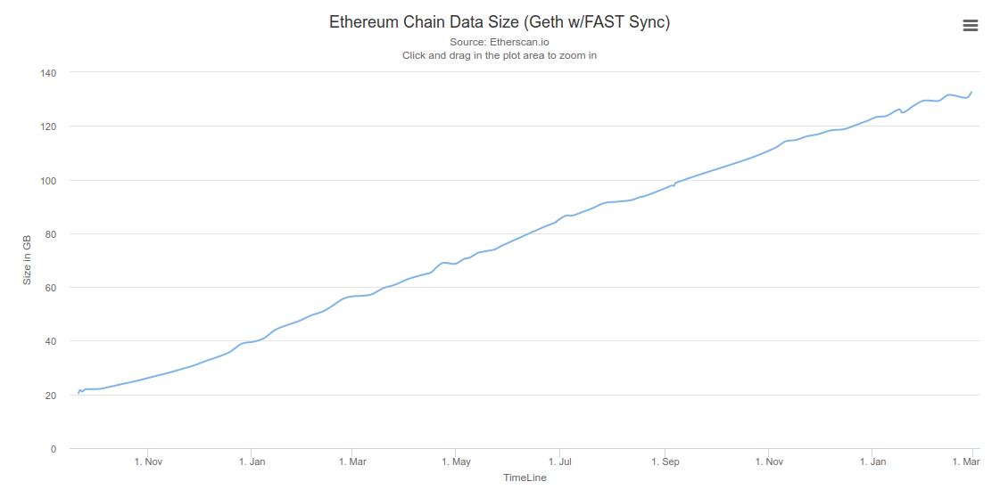
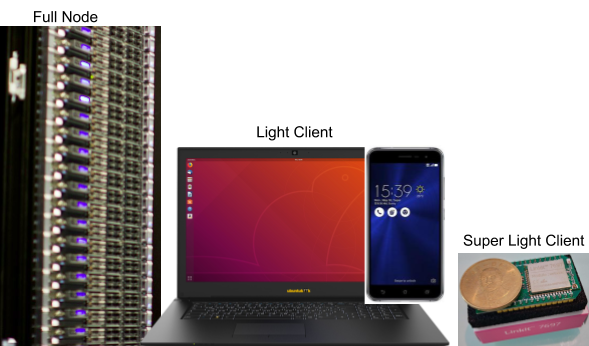
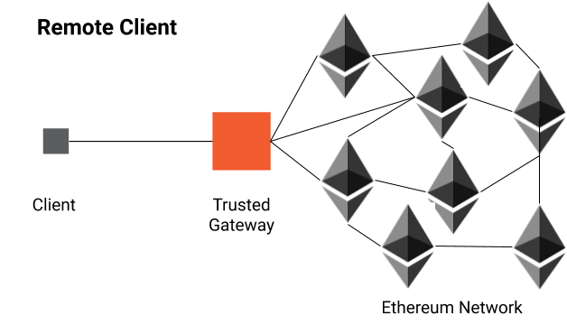
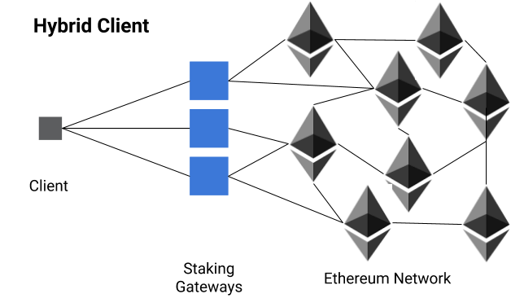
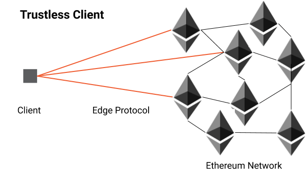

You just decided to start your next project using blockchain. That is awesome congrats! But now you face the many choices: Which blockchain platform and clients are technically suited for your use case?

Makers and IoT specialists know that when designing embedded systems it's important to understand the technical parameters within which each component can work. The same is true when selecting the blockchain technology. Required storage capacity on the device, RAM usage, and bandwidth required are the three key technical criteria to look at - when deciding which hardware to settle on, or which blockchain technology to adopt. To illustrate this, the HTC Exodus smartphone decided to adopt Bitcoin and integrate a client type that requires around 200 gigabytes of persistent storage dedicated to the Blockchain connectivity. On the other hand blockchain prototypes have been developed on devices such as the ESP32 with less than one megabyte of persistent storage

## Classes of Blockchain Clients

To understand these differences in required storage we have to look at the different types of software clients for blockchains. In the case of Bitcoin and Ethereum, there are _full nodes_ and _light clients_ as well as the recent class of _super light clients_. Full nodes are typically run on servers in data-centers or used for mining the cryptocurrency itself. These full nodes require hundreds of gigabytes of storage. Light clients require less storage usually within a few gigabytes, but also offer less functionality since they don't hold all transaction information. Light clients only need to download the block headers of the blockchain and are designed for desktop and mobile wallet applications. The amount of data they have to store is much smaller but still grows at the same pace as the blockchain itself. As a light client stores each block header when the number of blocks in the chain doubles the amount of data that the light client has to download doubles as well.

The third class of _super light clients_ requires even less storage. These are clients that do not need to download every single block header for validation and are designed for resource-constrained devices. As a result super light clients can't be used to monitor the blockchain in real time, but rather are able to read data punctually.

In the case of Ethereum here is a snippet of three entrants, one from each category, with their storage requirements indicated:

<table>
<tr>
 <th>Class</th>
 <th>Network</th>
 <th>Client Implementation</th>
 <th>Storage Required</th>
</tr>
<tr>
 <td>Full</td>
 <td>Ethereum</td>
 <td>Geth --syncmode=fastsync</td>
 <td>140gb</td>
</tr>
<tr>
 <td>Light</td>
 <td>Ethereum</td>
 <td>Geth --syncmode=light</td>
 <td>1.2gb</td>
</tr>
<tr>
 <td>Super-Light</td>
 <td>Ethereum</td>
 <td>BlockQuick</td>
 <td>20kb</td>
</tr>
</table>

There are fundamentally different means of implementing super light clients. Today three generations are prevalent:

**1st Generation: Remote Clients.** These clients rely on a **trusted central server** or a set of central servers that they use as gateways into the blockchain. Remote clients do not validate the data themselves but trust their central servers to have done all the validation. Examples of this are the Infura Gateway service and the IOTA client for the ESP32 chipset. These clients do not bring the actual blockchain security nor any of the decentralization but are often used during prototyping as they allow to quickly demonstrate features of the blockchain in environments where no trustless client is available yet or not practical.

**2nd Generation: Hybrid Clients.** The hybrid clients are similar to remote clients but add a level of security and decentralization to the protocol. Typically this is achieved through a scheme in which the gateways are staking a certain amount of value. If one of the gateways is found to be dishonest or providing a wrong fork of the blockchain the clients have means to submit a fraud-proof to the blockchain and thus penalize the misbehavior and the gateways risk to lose their stake. Examples of this are the [SlockIt](https://slock.it) and [Chainsafe](https://chainsafe.io/).

**3rd Generation: Trustless Clients.** The newest generation of super light clients with research work from earlier this year. The two known algorithms today are FlyClient and BlockQuick both can validate the data they receive using only a fraction of all block headers. They have the ability to differentiate between well-behaved and ill-intentioned servers based on the data and are thus trustless. Open-source implementations are though not yet available. Diode.io is working on an implementation of BlockQuick while the current state of FlyClient is unknown.

## Table of Clients

<table>
<tr>
 <th>Client</th>
 <th>Trust</th>
 <th>Storage </th>
 <th>RAM </th>
 <th>Sync Bandwidth</th>
</tr>
<tr>
 <td>geth --syncmode=fastsync</td>
 <td>Trustless</td>
 <td>200gb</td>
 <td>1gb</td>
 <td>~100mb per day</td>
</tr>
<tr>
 <td>geth --syncmode=light</td>
 <td>Trustless</td>
 <td>1.2gb</td>
 <td>150mb</td>
 <td>~3.5mb per day</td>
</tr>
<tr>
 <td></td>
 <td></td>
 <td></td>
 <td></td>
 <td></td>
</tr>
<tr>
 <td>BlockQuick</td>
 <td>Trustless</td>
 <td>20kb</td>
 <td>50kb</td>
 <td>20kb per sync</td>
</tr>
<tr>
 <td>FlyClient1</td>
 <td>Trustless</td>
 <td>?</td>
 <td>?</td>
 <td>400kb per sync</td>
</tr>
<tr>
 <td></td>
 <td></td>
 <td></td>
 <td></td>
 <td></td>
</tr>
<tr>
 <td>SlockIt Staking Client2</td>
 <td>Hybrid</td>
 <td>160kb</td>
 <td>?</td>
 <td>?</td>
</tr>
<tr>
 <td>Infura</td>
 <td>Gateway</td>
 <td>4kb*</td>
 <td>~10kb</td>
 <td>0kb</td>
</tr>
<tr>
 <td></td>
 <td></td>
 <td></td>
 <td></td>
 <td></td>
</tr>
<tr>
 <td>IOTA Node</td>
 <td>Trustless3</td>
 <td>8gb</td>
 <td>4gb</td>
 <td>1gb per day</td>
</tr>
<tr>
 <td>IOTA ESP32</td>
 <td>Gateway</td>
 <td>4kb</td>
 <td>10kb</td>
 <td>0kb</td>
</tr>
</table>

1. For FlyClient there is no implementation yet, the bandwidth is taken from the paper
2. [Numbers from slock.it video](https://www.youtube.com/watch?time_continue=107&v=EDJWb3fWB1w), the nano client is not yet available for testing.
3. IOTA itself is currently centralized on its coordinator nodes. [Numbers from FAQ](https://www.iota.org/get-started/faqs)

---

If you're interested in getting involved in light clients and blockchain clients for constrained devices, especially in the context of Ethereum have a look at the Ethereum magicians group here [https://ethereum-magicians.org/c/working-groups/constrained-resource-client-ring](https://ethereum-magicians.org/c/working-groups/constrained-resource-client-ring) or join the ring. We're actively supporting and contributing research to improve IoT devices access to the blockchain and believe this is a topic the community will be able to push forward together.

Find our more about the details of how BlockQuick's consensus reputation table works in our previous [blog post](/blockquick/blockquick-consensus-reputation-table-explained-19182/). The Proof of Concept (POC) code of BlockQuick will soon to be released on GitHub; you will be able to see how the reputation is being calculated. So stay connected! Follow us on [Twitter](https://twitter.com/diode_chain) and our [website](https://diode.io/). Stay up-to-date and subscribe to our newsletter.