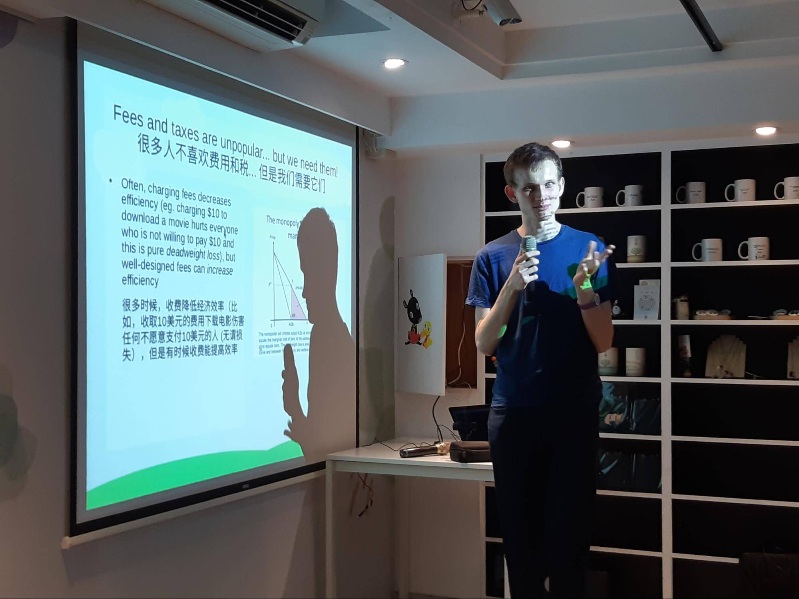
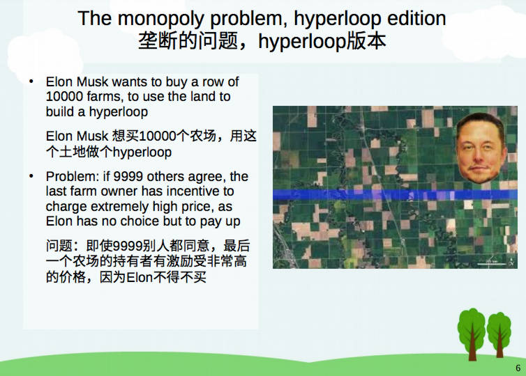
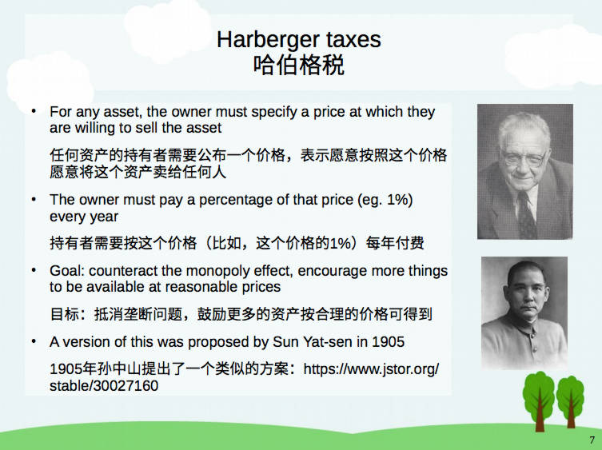
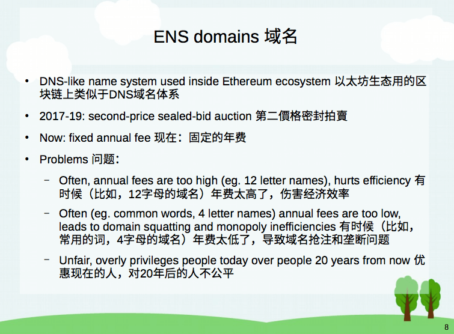
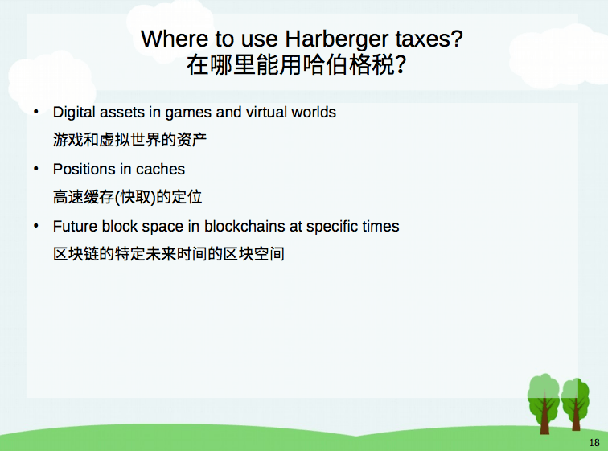

On Tuesday (7/16), Vitalik Buterin, the creator of Ethereum, gave a 30-minute presentation entitled, “Harberger taxes for virtual property.” In his presentation (18 slides in English and Mandarin) at the first event of [RadicalxChange Taipei](https://twitter.com/rxctaipei), Vitalik looked at what Harberger taxes are and what are the ways to apply Harberger taxes for domain names. Vitalik’s presentation starts at 1:50:47 in the YouTube [video](https://www.youtube.com/watch?v=6S5j35Y9AzQ).

<iframe width="100%" height="596" src="https://www.youtube.com/embed/6S5j35Y9AzQ" frameborder="0" allow="accelerometer; autoplay; encrypted-media; gyroscope; picture-in-picture" allowfullscreen></iframe>

[Diode](https://twitter.com/diode_chain), a developer of blockchains for IoT devices, believes in the vision of [decentralized PKI](/burning-platform-pki/decentralized-pki-in-a-nutshell-19079/). We think highly of decentralized alternatives to DNS, such as [the Ethereum Name Service (ENS)](https://ens.domains) and [Handshake](https://handshake.org). This write-up of Vitalik’s latest take on the topic is to show our support to the growing blockchain community; we look forward to having further discussions! Our CTO [Dominic Letz](https://twitter.com/dominicletz) published a [paper](https://eprint.iacr.org/2019/579.pdf) recently to introduce [BlockQuick](/burning-platform-pki/blockquick-super-light-blockchain-client-for-trustless-time-19144/), a super light client protocol for blockchain validation on constrained devices. Would love to hear your thoughts and feedback!

## Highlights of Vitalik’s presentation at the Taipei event

In his talk, Vitalik expressed interest in applying Harberger taxes on ENS domain names because ENS domain names have the following characteristics: 1) are non-fungible (every name is unique), 2) have monopoly issues (you can squat on a domain name and then nobody can use it), 3) need investment efficiency (when you purchase a domain name, you invest a lot of efforts to make the name famous) , 4) are fine with less than perfect ownership (if you can't own your domain name for the rest of your life, that's not a serious issue for most people).

He discussed several design proposals on the issue, including the existing simple auction, a simple Harberger tax, and auction-set annual fees. To conclude, Vitalik envisioned that Harberger taxes could be applied in digital assets in games and virtual worlds.

## Harberger taxes for virtual property

Fees and taxes are unpopular... but we need them!
We love quadratic funding (yay, more money for public good projects!) but the funding needs to come from somewhere.

Often, charging fees decreases efficiency (eg. charging $10 to download a movie hurts everyone who is not willing to pay $10 and this is pure deadweight loss), but well-designed fees can increase efficiency

In a perfect economy...
"Tax the congestable and subsidize the increasing returns" - Glen Weyl

### The monopoly problem

- Suppose I have an apple, and I value the apple at $2 (so I am willing to give it to you if you pay >$2)
- You want the apple, and value it at $3. But I don’t know that, I think, maybe you value it at $3, maybe at $10
- At what price should I offer to sell?
- If I sell at $2.01, you will definitely get the apple if you value it more than me, but then I make no profit
- So I might sell for $2.5, or $4. But then there is a high risk I overestimated how much you are willing to pay, and so a mutually beneficial transaction does not happen

### The monopoly problem, hyperloop edition
* Elon Musk wants to buy a row of 10000 farms, to use the land to build a hyperloop
* Problem: if 9999 others agree, the last farm owner has incentive to charge extremely high price, as Elon has no choice but to pay up

### Harberger taxes
* For any asset, the owner must specify a price at which they are willing to sell the asset
* The owner must pay a percentage of that price (eg. 1%) every year
* Goal: counteract the monopoly effect, encourage more things to be available at reasonable prices
* A version of this was proposed by Sun Yat-sen in 1905 (https://www.jstor.org/ stable/30027160)

### ENS domains

* DNS-like name system used inside Ethereum еcosystem
* 2017-19: second-price sealed-bid auction
* Now: fixed annual fee
* Problems
    * Often, annual fees are too high (eg. 12 letter names), hurts efficiency
    * Often (eg. common words, 4 letter names) annual fees are too low, leads to domain squatting and monopoly inefficiencies
    * Unfair, overly privileges people today over people 20 years from now

### Option 1: Simple Harberger tax
* Every holder of a domain must specify the value of their domain
* They must pay 3% of that per year
* Anyone can automatically buy at that price and take control after a 3-month waiting period

### Problems
* Owners are not good at calculating how much they value their own domains, they are better at evaluating “yes or no” on given sell prices
* Not enough stability for owners

### Option 2: auction-set annual fees
* Every domain has an associated bidding smart contract, anyone can place a bid
* Bidding X on a domain requires sending X ETH to a smart contract (unless the bid is accepted, you can recover the ETH at any time by withdrawing the bid)
* Owner has the ability to accept the top bid at any time
* Owner charged annual fee based on (eg. 3% of) the top bid

### Modifications
* Cap the rate at which fees can change (eg. to 2x per 3 months)
* Cap the annual fee (eg. to $100 per year)

### Problems
* Does not solve monopoly problems as effectively
    * If I see you already bought one domain (eg. ethereum.eth), I can check what other domains you might want (eg. etherium.eth, etereum.eth, ether.eth) and raise the price (under simple Harberger tax you can buy all at the same time)

### Advertising space
* Advertising is potentially a good way to fund user-facing software
* Incentive tied directly to getting more users
* Should we use Harberger taxes to sell advertising space?

### Just use auctions?
* Have an auction every day for what ads appears the next day
* What’s the problem here?

### Just use auctions?
* Harberger taxes are designed to compromise between **allocative efficiency** (ensuring each item goes to whoever needs it most) and **investment efficiency** (preserving incentive for long-term investments)
* Domain names need investment efficiency (because making a project with a name is an investment), but do ads?
* Often no, but sometimes yes (keywords)

### Where not to use Harberger taxes?
* Property is fungible, no monopoly issues (eg. Coins)
* No need for investment efficiency
* Less than perfect ownership stability too risky

### Where to use Harberger taxes?

* Digital assets in games and virtual worlds
* Positions in caches
* Future block space in blockchains at specific times
