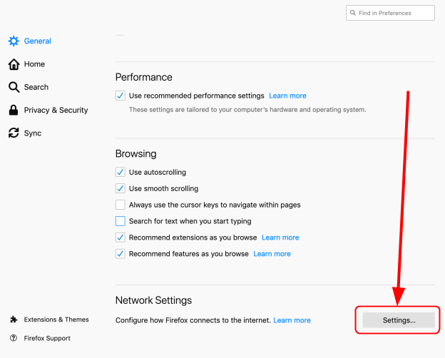

Last month, the trade association for internet service providers in the U.K. has [nominated Mozilla for this year’s award of Internet Villain](https://www.zdnet.com/article/uk-isp-group-names-mozilla-internet-villain-for-supporting-dns-over-https/) because Mozilla plans to support DNS-over-HTTPS that would bypass U.K. filtering obligations and parental controls, undermining internet standards in the U.K.

At Diode, we think Mozilla's DNS-over-HTTPS in general is a good move for increasing the privacy of end-users; however, it is not the best option for protecting an open internet as DNS-over-HTTPS, at least currently, is heavily centralized by CloudFlare and Google. Therefore, we would like to suggest "DNS-on-Blockchain," an alternative for secure, privacy-preserving and decentralized DNS, and here’s why.

### What is DNS?

The [Domain Name System](https://en.wikipedia.org/wiki/Domain_Name_System) is a hierarchical and federated naming system for computers, services, or other resources connected to the Internet or a private network. As defined in [RFC 1035](https://tools.ietf.org/html/rfc1035), the goal of DNS is to provide a mechanism for naming resources in such a way that the names are usable in different hosts, networks, protocol families, the internet, and administrative organizations. It’s a group of standards that associates various information with domain names, like IP address.

With DNS server, we don’t have to memorize IP address to connect to a website. When you enter a domain name of website in your browser, you automatically send a request to DNS server. DNS server lookup the domain and returns IP address so your browser knows where to connect to.

But here is the problem. The DNS packet is unencrypted, when you send a request to DNS server, not only the DNS server knows your request and which website you want to visit, but also everyone else on the route. In a coffee shop this might be everyone else in the same shop, the Shop owner, the Internet Service Provider or any hacker who spies on internet traffic. This is why DNS-over-HTTPS was created.

### What is DNS-over-HTTPS ?

[DNS-over-HTTPS](https://de.wikipedia.org/wiki/DNS_over_HTTPS), or **DoH** for short, is a protocol to resolve DNS requests via the securely encrypted HTTPS protocol. A goal of the method is to increase user privacy by preventing eavesdropping and increase security by preventing manipulation of DNS data through a man-in-the-middle.

With DNS-over-HTTPS, you send an encrypted HTTPS request to a DNS server that supports DoH when you enter a domain name of website in your browser. The HTTPS protocol is decrypted only at the DNS server where the DNS request is processed and the reply is sent back encrypted again. You don’t have to worry about anybody spying on you. Isn't this perfect? Not quite, and here are the reasons.

### Problems with DNS-over-HTTPS

As bad as the current state of privacy is in DNS, it is though one of the very well federated systems. There are thousands of independent DNS servers together supporting the internet. On the other hand, when you use DNS-over-HTTPS you are sending your data effectively to either Google or Cloudflare. This is a **huge step back from federated infrastructure to centralized infrastructure**. Their DoH servers will still know exactly which DNS requests you make and where you want to connect to. We all know that sharing too much data with a third-party is dangerous, these big companies could record your DNS query history, match it with your other personal data or sell the query history to third parties.

Earlier this month, Cloudflare's servers went down because they updated the server and the new code consumed lots of CPU resources. Because so many websites are using Cloudflare as their delivery network, some big sites went offline at that time. Cloudflare's recent incident is an example of a single point of failure (SPOF) event. If the DoH server are centralized and are going down, you won't be able to surf the internet. This shows another risk of centralization around a few operators.

Lastly, encrypting DNS traffic does solve the privacy problem, but it does not ensure that the data we are receiving is correct. PKI, or Public Key Infrastructure, is a centralized rooted security infrastructure to encrypt nearly all of today's internet traffic. It's the security infrastructure behind HTTPS. If an attacker manages to steal the certificate of a HTTPS server, he can impersonate the server, read all the traffic and even send a fake results of DNS requests to the client.

### DNS on Blockchain

The core problem of DNS-over-HTTPS is the central organization and missing validation of the data we receive. This central Infrastructure is becoming a single point of failure (SPOF) for security and a nightmare for privacy with a few big companies learning more and more about us. At [Diode](https://diode.io), we believe the decentralized blockchain infrastructure is the perfect platform for DNS. We believe that [decentralized PKI](https://hackernoon.com/decentralized-public-key-infrastructure-dpki-what-is-it-and-why-does-it-matter-babee9d88579) and decentralized DNS are the future of the internet. You won’t have to worry about somebody spying on you when you surf the internet and can be assured that the data you are receiving is valid and authentic.

In decentralized DNS, the owner of a domain such as "youtube.com" stores his/her cryptographic signatures on a public blockchain. This allows any Web browser, Smartphone App or IoT device to check the corresponding blockchain entry and find the correct signature. This scheme allows the domain owner to self-sufficiently manage his domains, and removes the need to contact a central organization to get a certificate. It further not only federates but completely decentralizes the serving of DNS requests, because each blockchain server can now serve the DNS data.

This new technology has been coming together mostly from Blockchain enthusiasts. Bitcoin created the decentralized ledger, one that is not controlled by any single entity but grows stronger with more participants. [Ethereum](https://www.ethereum.org/) brought the smart-contracts and the ability to store arbitrary structured data on the blockchain. And [Namecoin](https://www.namecoin.org/) and the [Ethereum Name System](https://ens.domains/) were the first attempts at bringing name resolution to the Blockchain. At [Diode](https://diode.io) we’re going the next step and are moving PKI & DNS into the Blockchain and critically allow the smallest devices such as micro controllers to connect securely to the Blockchain.

### Enable DNS-over-HTTPS in Firefox

In the meantime before DNS-on-Blockchain (DoB) becomes available you can at least upgrade to DoH and preserve you privacy. If you are using Firefox then DNS-over-HTTPS (DoH) is already built in - but disabled by default! All you need to do to switch it on is follow these steps:

Step1: Go to Firefox menu and choose Preferences, or you can type about:preferences in search bar.

Step2: In General section, go to Network Setting panel, and click the Settings button.

Step3: In the pop, scroll down and Check Enable DNS over HTTPS. You can setup another DoH providers or use Cloudflare (default). Mozilla has a strong [Trusted Recursive Resolver (TRR) policy](https://wiki.mozilla.org/Security/DOH-resolver-policy) in place that forbids DoH partners from collecting personal identifying information.

Happy Browsing!
