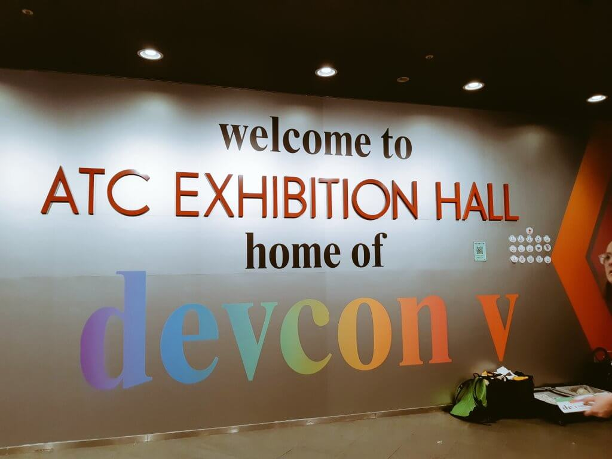
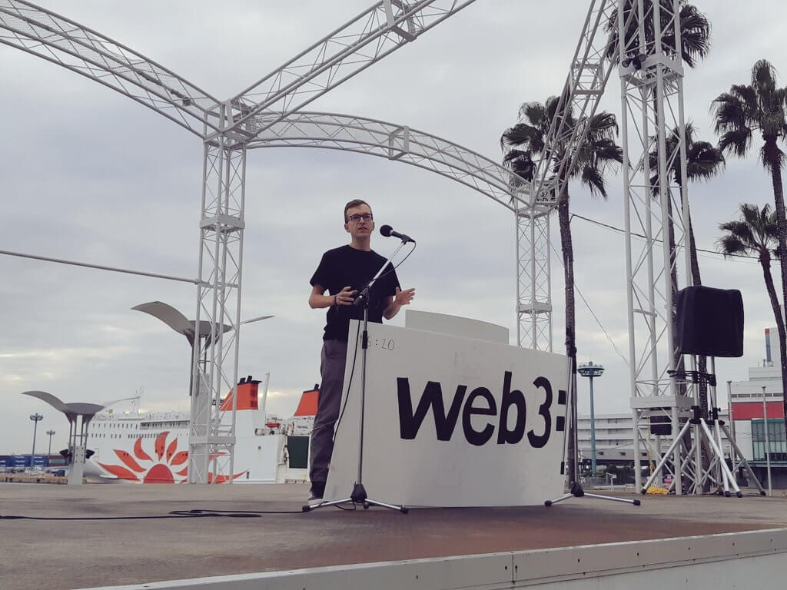
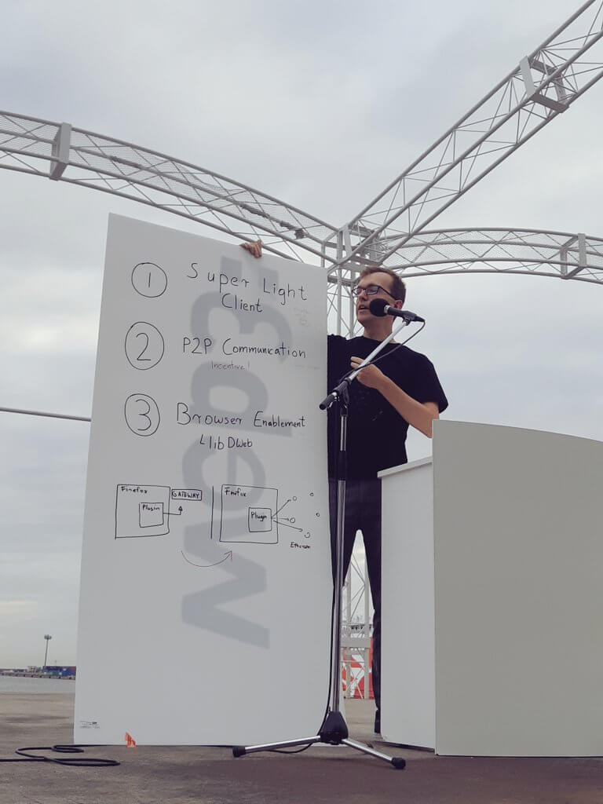
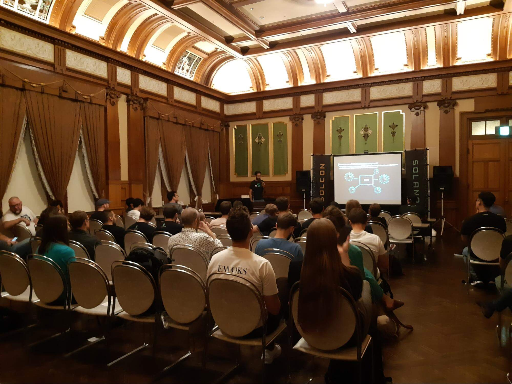

This month, Diode CTO Dominic Letz and marketing team attended [DevCon 5](http://devcon.org) and several off-devcon events in Osaka, Japan. In addition to meeting leaders of the Ethereum community, we also took the opportunity to discuss the challenges in realizing the Web3 vision on Day 3 at the Amphitheater.

We had a great experience at the conference. It was a pleasure to meet Ethereum Research core team, developers of Remix, members of the Ethereal Name Service (ENS), coordinators of the Ethereum Magicians, core team members of imToken, researchers who hosted the Scaling Ethereum research workshop in Toronto, Canada, researchers of zk-SNARKS, community leaders of Kuala Lumpur, Malaysia; Sydney, Australia; Bangkok, Thailand, and a couple smart contract workshop instructors from Europe. 

 

Many people gave us positive feedback. During the week in Osaka, some of the discussions had provided us a unique opportunity to learn more about the issues at stake from multiple perspectives.

It was an honor to be able to share some of our development updates with such a vibrant community. We were particularly excited to see a variety of topics being covered at DevCon, including Eth 2.0, L2 Scaling, zero-knowledge proofs, governance, decentralized finance (DeFi) applications, Enterprise solutions, and the RadicalxChange movement.

On Day 3 at Devcon, Dominic took the center stage to give the community a highlight of the three things that are still missing in the Ethereum ecosystem in order to achieve a fully distributed web (web3): Super light clients, peer-to-peer communications, and browser enablement.

1. Super light clients: 
So far there are two papers that are making clients with less than 1MB of storage possible: our own [BlockQuick](https://eprint.iacr.org/2019/579) and [FlyClient](https://eprint.iacr.org/2019/226). Nevertheless, at this point there is no Ethereum standard implementation yet.

2. Real-time P2P messaging: 
What Whatsapp and Telegram have become for personal messaging, is still missing for your browsing needs. Protocols such as [Telehash](http://telehash.org/) exist, but they still experience a lack of adoption because there is no built-in incentive mechanism. We believe a blockchain native protocol with tightly coupled incentive mechanisms is the right way to go.

3. Browser enablement: 
Having implemented all protocols, the next step is to have a great user experience for the Web3 to get adoption and to fully realize its potential. Mozilla has started a project called “libdweb” ([https://github.com/mozilla/libdweb/](https://github.com/mozilla/libdweb/)) that looks into allowing custom communication protocols for schemes such as **dat://** or **web3://**.

At Devcon, SlockIt meetup, Solana events, Cryptoeconomics Lab’s Layer 2 events, and many other off-devcon events, we spoke about how Diode Chain and the BlockQuick super light client can help make Web3 a reality. We look forward to seeing a continuous growth in the blockchain community as we move towards building blockchain-based decentralized PKI for IoT devices.

Finally, check out our [Github](https://github.com/diodechain) and the BlockQuick [paper](https://eprint.iacr.org/2019/579.pdf) to be among the first to learn about the details of the Diode Chain.
