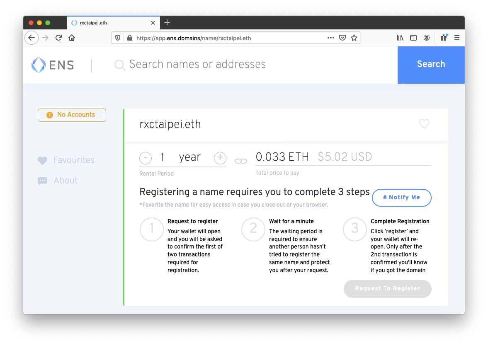

In this article, we will outline the steps required to deploy a static website under your ens name. One example is my personal website hosting on IPFS using “yahsin.eth” my ENS custom domain. What it does is that anyone can visit [https://yahsin.eth.link/](https://yahsin.eth.link/), the browser would return an introduction of myself. It will work faster if the viewer has MetaMask readily installed. View a list of ENS+IPFS websites compiled by Almonit here: [https://almonit.eth.link/](https://almonit.eth.link/)

If you’re interested in expanding beyond static websites into decentralized hosting and collaboration, explore how the Diode Network enables dynamic, encrypted communication through [Diode Collab](https://collab.diode.io/) — an all-in-one platform for secure team messaging, file collaboration, and Web3 website publishing. It’s a practical way to host decentralized websites or even run a fully private messaging app, all built on the Diode Network.

<iframe width="560" height="315" src="https://www.youtube.com/embed/oA4oOY5zgU0" frameborder="0" allow="accelerometer; autoplay; encrypted-media; gyroscope; picture-in-picture" allowfullscreen></iframe>

So, how can you do that? Let’s dive right in!

Step 1. Registering an ENS name

Step 2. Creating a static website

Step 3. Adding your website content to IPFS

Step 4. Updating the ENS record content field with the IPFS hash of the website

First, you need to get an ENS domain name. ENS, or the Ethereum Name Service, is a domain service that assigns a particular domain that can be tied to your wallet’s account address. Your .eth names are incredibly useful because you get to send ETH by providing a simple, human readable url instead of a long string of random numbers and letters that anyone can mess up.

Registering an ENS name is relatively easy compared with most of the crypto applications! Go to [https://app.ens.domains/](https://app.ens.domains/). Search .eth domains and see if they are still available. You’ll need some Ethers (ETH) in your MetaMask wallet to buy ENS domain names. If you don’t have any, you can get some from your friend or buy some from an exchange, but the detail is out of the scope of this tutorial.



Then, you want to create a simple static website. It can be as simple as an index.html file as this example shows. Add proper CSS or JavaScript to decorate it if you like.

```html
<html>
    <head>
    </head>
    <body>
        <h1>Hello! Welcome to IPFS</h1>
        <p>And this frame below is from the Diode Prenet</p>
        <iframe src="https://rw-0x780980bfc0aa56ceb1417e87912e54b759463090.diode.link"></iframe>
    </body>
</html>
```

I wouldn’t recommend getting your website fancier beyond the above example. The IPFS doesn’t work like a server we are used to, so loading many pages or images may involve non-trivial front-end tricks to work well.

Once you’ve prepared a simple, beautiful index.html file, you are ready to go! Go to [https://github.com/ipfs-shipyard/ipfs-desktop](https://github.com/ipfs-shipyard/ipfs-desktop) and download the latest release of IPFS Desktop. Click the +Add button in the upper-right corner of the IPFS window to add your index.html.


The most important step is adding your IPFS hash to your ENS record. Go to [https://app.ens.domains/](https://app.ens.domains/)

Add the IPFS hash to your ENS record in the “Content” field record type. IPFS is a peer-to-peer file sharing system, so it might take a few minutes for the content to propagate through the network. And that’s it! Very simple way to host a decentralized website using ENS domain names and IPFS distributed content system. We’re using IPFS in this example, but you can easily use other distributed storage systems such as Swarm ([https://ethersphere.github.io/swarm-home/](https://ethersphere.github.io/swarm-home/)), or DAT ([https://dat.foundation/](https://dat.foundation/)).

View my ENS+IPFS decentralized website: [https://yahsin.eth.link/](https://yahsin.eth.link/)


Above is a screenshot showcasing the IPFS deployment of the Diode Prenet example website.

**The Diode Network**

Designed for IoT embedded devices, Diode is an integrated blockchain implementation of the Web3 - the vision of the server-less internet, the fully decentralized web. We are seeing a trend of moving away from the client-server model towards peer-to-peer networks


Above is a screenshot showing a [demo website](https://pi-taipei.diode.link) of Diode network. This demo website showcases the potential of streaming real-time data through the Diode network. 

For Raspberry Pi makers, for example, when streaming real-time data such as videos and films, if you want to have access to your local streaming remotely or outside your local network, you will need to set up a proxy or a VPN to achieve this. Now you have another option! The Diode network allows you to have access to your local streaming data with end-to-end encrypted data transmission. It is more secure than setting up a standard proxy.

While IPFS is perfect for hosting static websites, the Diode blockchain network is great for hosting dynamic content such as interactive chat clients and livestream videos. Anyone who has your public key (public address or decentralized identity) will be able to get end-to-end encrypted access to the dynamic content that his or her is serving. The whole network traffic will be end-to-end encrypted and go through Diode’s peer-to-peer network, allowing anyone to turn their his or her computers into web servers of the web3.

Currently, we are developing a Firefox browser plugin to allow more users to be able to access the first Web3 Network Diode. The goal is to make the system easily accessible to website providers, makers, hackers, and the general public. Because it is using the BlockQuick algorithm it is able to run fully decentralized on a wide range of devices including Arduino, Raspberry Pi and ESP32.

Check out our [GitHub](https://github.com/diodechain) and the BlockQuick [paper](https://eprint.iacr.org/2019/579.pdf) to be among the first to learn about the details of the Diode Chain. Follow [Twitter](https://twitter.com/diode_chain) for updates, news, and tips.
