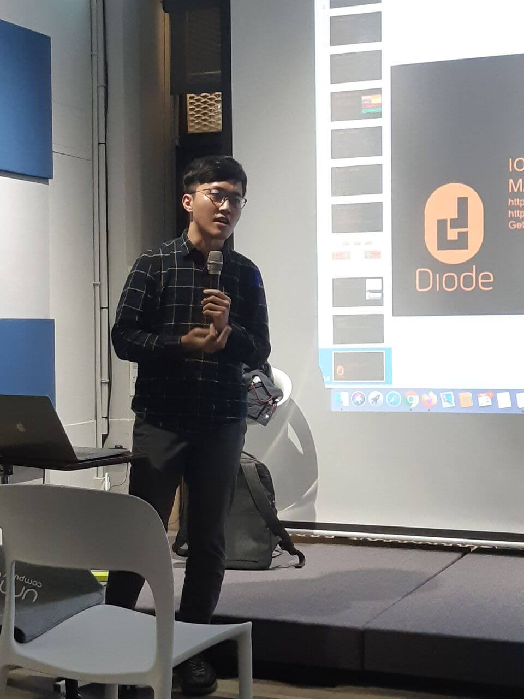
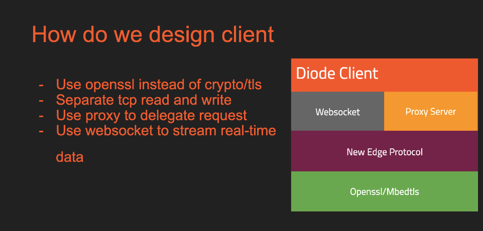

On Tuesday, December 24, we had the opportunity to present our work at [the Golang Taipei Meetup](https://www.meetup.com/golang-taipei-meetup/events/267181856/). The venue was the very cool [MaiCoin’s co-working space](https://g.page/MaiCoinHQ?share) in Taipei City, which Taipei City Mayor [Ko Wen-jen](https://english.gov.taipei/News_Content.aspx?n=A11F01CFC9F58C83&sms=DFFA119D1FD5602C&s=7FE02B7C298D43A5) had once visited last August.

Thanks to [David Chang](https://www.meetup.com/golang-taipei-meetup/members/187296721/profile/), David Chou, [Evan Lin](https://twitter.com/Evan_Lin) and everyone who helped out with the meetup. We had a great time seeing the excitement and energy from the [Golang Taipei](https://twitter.com/GolangTW) community.

Presentations at the meetup were incredibly interesting and inspiring. First up was David Chang, the host of the event. He gave a brief overview of a popular MIT online course “[MIT 6.824](https://youtu.be/hBWfjkGKRas)” on distributed systems, an introduction of [MapReduce](https://en.wikipedia.org/wiki/MapReduce) the programming model as well as discussing the possibility of implementing MapReduce in Golang. Most of the concepts he talked about were coming from Google’s 2004 [paper](https://static.googleusercontent.com/media/research.google.com/en//archive/mapreduce-osdi04.pdf).

We were honored to be able to present [Diode](https://github.com/diodechain) at the event. In his presentation, blockchain engineer [Peter Lai](https://twitter.com/alk03073135) talked about why Diode client was written in Go, discussed concurrency bugs in Go, gave a live demo of Diode network using a Raspberry Pi that’d been previously set up from the Taipei office, and ended the talk with a Q&A session. 

View the [presentation slides](https://github.com/diodechain/presentations/blob/master/Golang_Taipei_Meetup_2019/Golang%20Taipei%20Meetup%202019%20Peter%20Lai_%20Why%20Diode%20client%20uses%20Go%20language.pdf) on GitHub.

### Questions posed from the audience during the Q&A session:

**Q:** If you can https/ssh Pi through the local network, why do you need Diode network? 

SSH: If you’re not local, Diode is the only choice. (SSH is not using PKI) \
Usually nobody is checking the remote key - so Diode is better since you don’t have to.

HTTPS: Even if you’re local, there are security issues when using a self-signed certificate to accessing your Pi. 

**Q:** Why did you want to design edgeRPC? Why don’t you go for existing options such as  gRPC or JsonRPC?

At this stage, we use edgeRPC to allow nodes to interact with devices. We started out with ASN1 (like OpenSSL - super small binary format), and there is a chance that we would start using JsonRPC.

**Q:** Did you experience any “inconsistency issues” when using OpenSSL? For instance, the functions in OpenSSL could be different, such as the  function interface parameters could be different.

When choosing a secure communication channel, we looked at RLPx and TLS (OpenSSL). We decided to use OpenSSL, but forced it into using Secp256k1 to ensure both sides authenticate with their Eth wallet keys. But this means we are forcing OpenSSL to only accept Secp256k1 and self-signed certificates (self signed using the wallet key). 

OpenSSL does support Secp256k1. However, not all TLS libraries and clients support Secp256k1 at this time. So this can lead to connection issues when not using OpenSSL. We will be researching other libraries such as ARMmbed, wolfSSL, and SChannel for that matter.

**Q:** How are you guys using websocket? 

The default Go client has a built-in capability to convert any binary TCP socket into a websocket. So, the Pi in the demo is simply publishing the raw video on port, and then the Go client is converting that into websocket frames.

**Q:** If you are using OpenSSL, does it mean you are using a CGo compiler?

Yes, we use CGo to call C functions.

If you're interested in being an alpha tester of the Diode network, sign up on our [Telegram](http://t.me/diode_chain) group, or reach out to us on [GitHub](https://github.com/diodechain/diode_go_client) or [Twitter](https://twitter.com/diode_chain).
