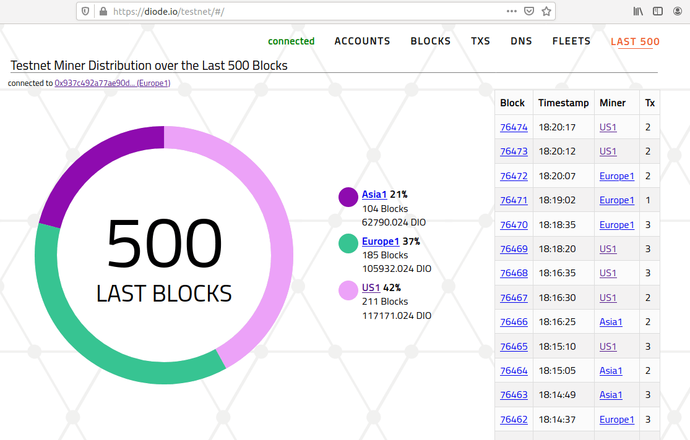
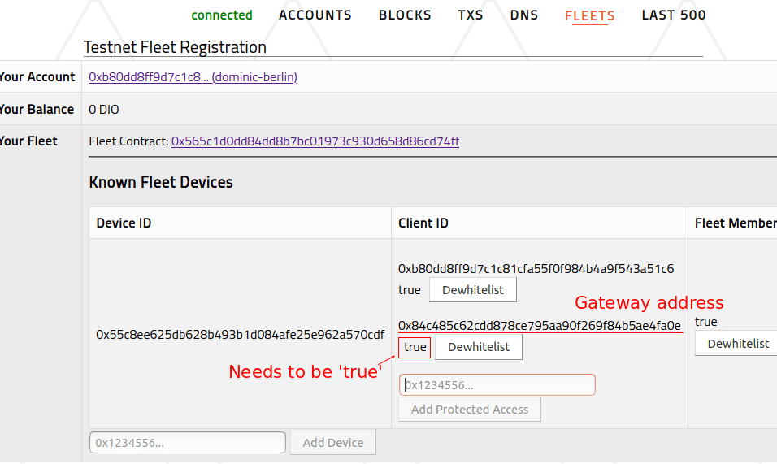
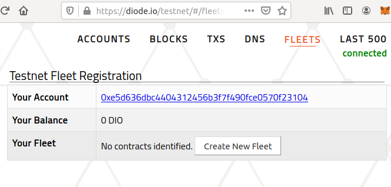
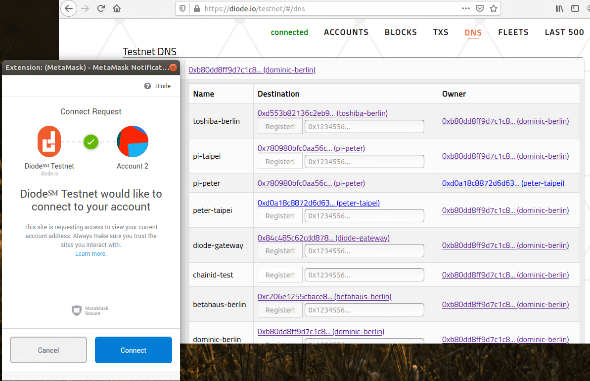
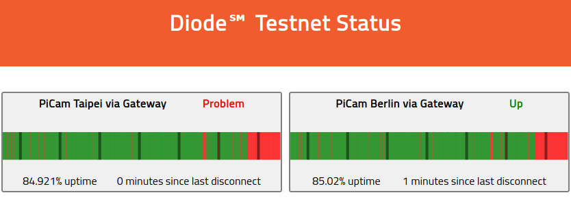
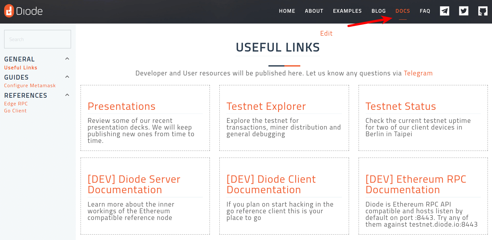

It's time again for an update on our progress over the last quarter. While last September and October were busy with events, the recent couple of months we spent some time working on our Prenet. We're getting ready to engage with the community again in several up-coming events:
* [ETH-Denver](https://www.ethdenver.com/) running [right now...](https://twitter.com/diode_chain/status/1228155750846873600)
* [Stanford Blockchain Conference](https://cbr.stanford.edu/sbc20/)
* [EthCC Paris](https://ethcc.io/)
* [Vienna ECDON](https://edcon.io/) 

But let's have a look what happened so far. 

## Roadmap Update

### Prenet Explorer

To explore and interact with our prenet we launched a MetaMask compatible [Prenet explorer](/prenet/#/). Importantly it visualized the current BlockQuick Proof-Of-StakeWork power distribution. 



### Web3 Diode Gateway

In order to allow easier demoing and quick experiencing of the network we have also launched an Web3 gateway that allows proxying traffic directly into the Diode-Mesh-Network without the need to install a client locally. We're offering a [SOCKS5](https://en.wikipedia.org/wiki/SOCKS#SOCKS5) based raw traffic service that allows using any data service such as SSH or FTP and a HTTP forwarder that proxies web content when offered by the devices.

All devices are addressable into the gateway using their Ethereum Address in hex format under the gateway domain _diode.link_ and _diode.ws_

```
https://<Ethereum Address>.diode.link
```

For example we have setup a Webcam on a Raspberry-Pi with a Webinterface exposed through the Diode Meshnetwork here: [https://0xc206e1255cbace8ba904daa259d7a5b7f90e2d50.diode.link](https://0xc206e1255cbace8ba904daa259d7a5b7f90e2d50.diode.link)

You can also use the Prenet Explorer to explore more information about this device [0xc206e1255cbace8ba904daa259d7a5b7f90e2d50](/prenet/#/address/0xc206e1255cbace8ba904daa259d7a5b7f90e2d50) such it's Fleet Contract 

When you want to use the Gateway for your own devices just ensure that the ports you want to expose - such as 80 for http - are accessible by the Gateway. The Gateway is running its own Diode Client with its own identity [0x84c485c62cdd878ce795aa90f269f84b5ae4fa0e](/prenet/#/address/0x84c485c62cdd878ce795aa90f269f84b5ae4fa0e). So put access for the ports you want to make accessible through the gateway either to _public_ or you add the Gateway Address to your _private_ or _protected_ group:

#### _public_

Public access makes for anything you publish through the gateway most sense, because the gateway also exposes it publicly. Just use the `-public` flag with the port number mapping:
```
diode_go_client publish -public 80:80
```

#### _private_

For private access you have to add the address of the gateway in the command line state used to start the diode client, like this:

```
diode_go_client publish -private 80:80@0x84c485c62cdd878ce795aa90f269f84b5ae4fa0e
```

#### _protected_

For protected mode first add the gateway address 0x84c485c62cdd878ce795aa90f269f84b5ae4fa0e to your fleet on [https://diode.io/prenet/#/fleets](/prenet/#/fleets)



```
diode_go_client publish -public 80:80
```

### Fleet Interface 

As part of our Prenet Explorer we have also launched a [Fleet Development Interface](/prenet/#/fleets). It automates the process of deploying the initial reference contract using MetaMask and adding devices. Before it was only possible from the command line using the Ethereum RPC API. If you don't have a fleet contract yet it will offer to create one. 



### Simple Blockchain Name System (BNS) Contract

For creating human readable links instead of above hex based addresses we deployed a simple [BNS Contract](https://github.com/diodechain/diode_contract/blob/master/contracts/DNS.sol) on the Diode prenet. This is also exposed in the Explorer via the BNS tab and can be used to register short domain names such as for our webcam, that is also reachable via [https://betahaus-berlin.diode.link/](https://betahaus-berlin.diode.link/) 



If you feel curious about trying it yourself checkout our [tutorial on how to setup MetaMask](https://network.docs.diode.io/docs/faq/configure-metamask/).

### Client Updates

We're constantly improving the go reference implementation and have archived a major milestone, by implementing a near optimal BlockQuick negotiation between server and client. Also more visibly the command line interface has been updated to make secure publishing of ports straight forward.

The client now supports three different permission levels for network ports:

* _Private_: Only accessible by individually assigned Ethereum Addresses
* _Protected_: Accessible by all members of the same Fleet
* _Public_: Accessible by anyone.

You can checkout the full list of command line parameters [here in our new docs](https://cli.docs.diode.io/docs/features/cli-commands/).

### Uptime Monitor

While were developing the BlockQuick clients and making further changes we're keeping score based on the uptime of deployed devices. For this we have created a [prenet status dashboard](/status/) that keeps track of the uptime of two selected devices. Over the coming weeks as we roll out new releases this will be our continuous score board.



### Documentation

Last but not least we have started a new documentation section on our website and will be adding guides and references over the next quarter.


