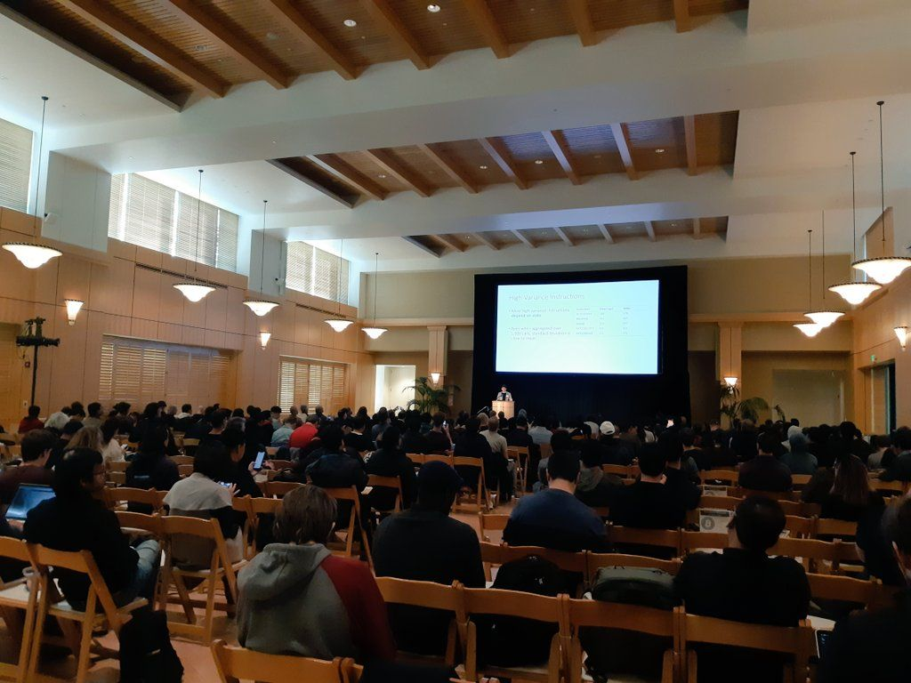
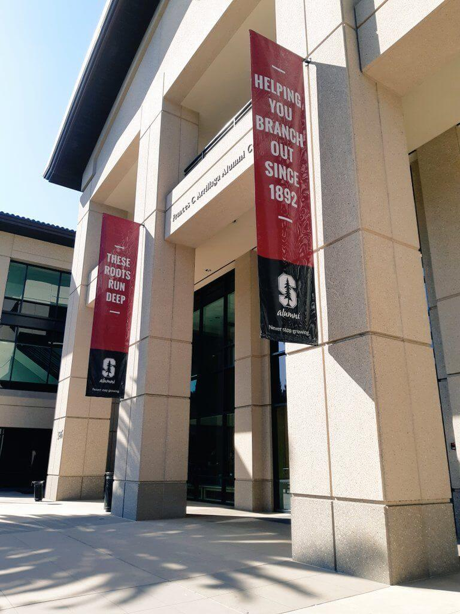
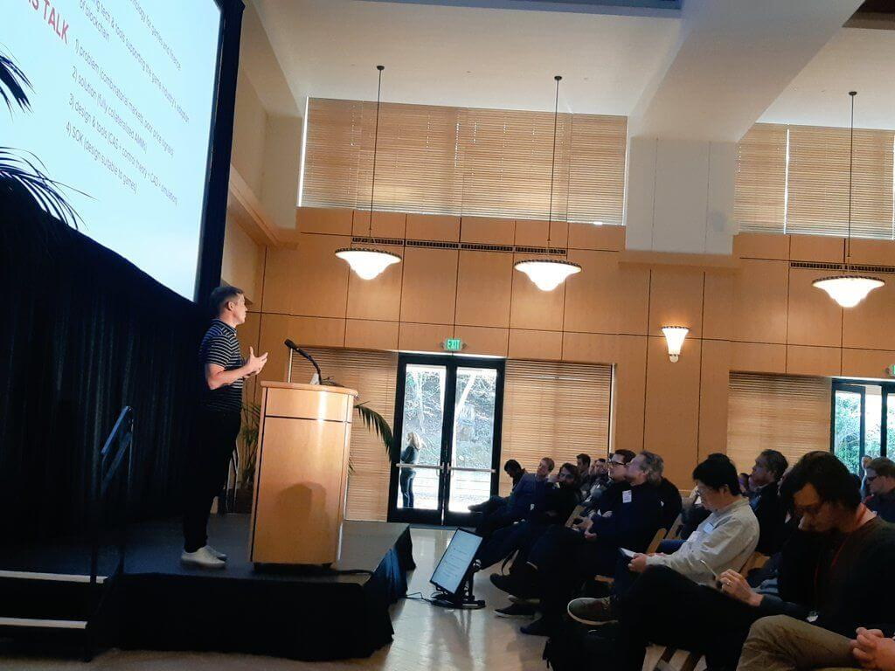
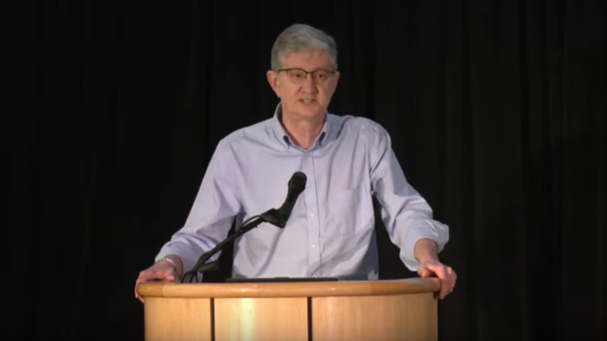
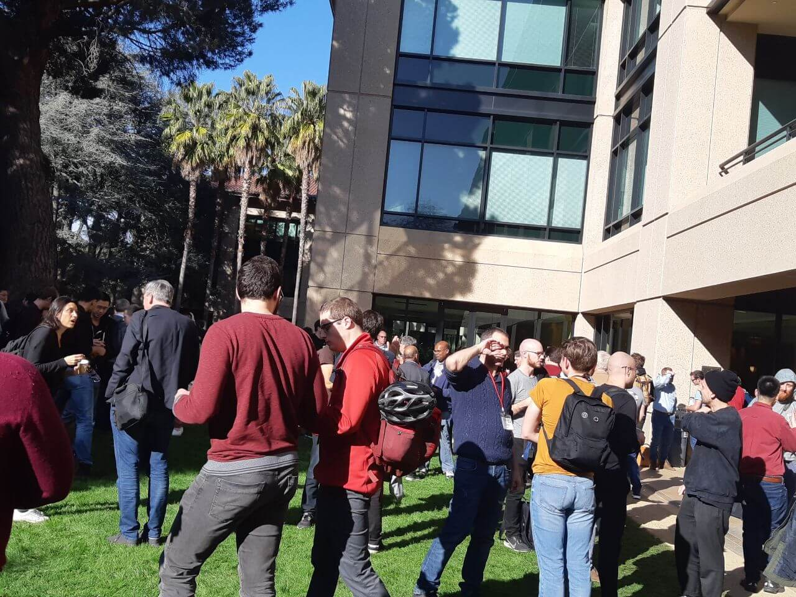

[The 4th Stanford Blockchain Conference (SBC)](https://cbr.stanford.edu/sbc20/) continues to educate attendees about the research and current issues around blockchain protocol development, cryptography, distributed systems, and crypto-economics.

The 3-day event was held from February 19 to 21 at Arrillaga Alumni Center, Stanford University in California. Hosted by [The Stanford Center for Blockchain Research](https://cbr.stanford.edu/), the event was free of charge and open to the public. Our team members blockchain engineer Peter and marketing Yahsin traveled from Taiwan to the U.S. to participate the event, and thought it was one of the most interesting blockchain conferences we have ever participated in.

Speakers included Ethereum creator Vitalik Buterin, co-founder and chief scientist of Offchain Labs Ed Felten, technical lead for Calibra Ben Maurer, and founder of Supranational Simon Peffers. Some of the most popular and most crowded sessions were Vitalik’s speech on beyond 51% attacks (watch [video](https://youtu.be/BXLcKQ6fLsU)), and Ben’s presentation on Facebook’s Move programming language (watch [video](https://youtu.be/JhZUItnyQ0k)).

[Ed Felten](https://en.wikipedia.org/wiki/Edward_Felten), co-founder and chief scientist of [Offchain Labs](https://offchainlabs.com/), gave a presentation entitled “Arbitrum 2.0: Off-Chain Performance with On-Chain Security” at the conference. Watch his presentation on YouTube (44:04): [https://youtu.be/JhZUItnyQ0k](https://youtu.be/JhZUItnyQ0k)

CTO [Dominic Letz](https://twitter.com/dominicletz) recently put out a development update in a [blog post](/diode/Diode-February-Update-20048/). Key updates included: we launched a MetaMask compatible Prenet Explorer, launched a Web3 gateway that allows proxying traffic directly into the Diode-Mesh-Network without the need to locally install a client, launched a felt development interface as part of our efforts in pushing forward our Prenet Explorer, as well as deployed a simple Blockchain Name System (BNS) contract on the [Diode prenet](/prenet/#/).

Check out the [demo video](https://youtu.be/Zibg-6CClc4) to learn about the benefits of Diode network. In the video, our engineers demonstrate some of the ways to use Diode’s Go client to do live video streaming. More technical details can be viewed on Diode's [Github repository](https://github.com/diodechain).

If you believe in the vast potential of a decentralized web, I invite you to join the Diode Telegram group. Follow our [Twitter](https://twitter.com/diode_chain) and subscribe to the [Diode YouTube](https://youtu.be/Zibg-6CClc4) channel for future updates!
