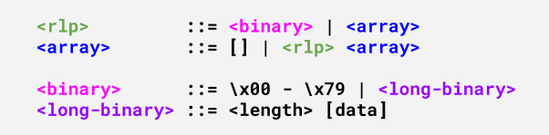
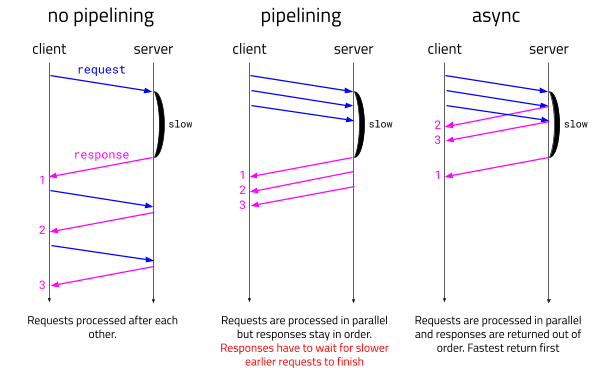

With the next major client update the Diode network will be using a new Edge Network Protocol. _Edge2_ is replacing the current _Edge1_ protocol. Nodes will be supporting both protocols for some time until all clients are being upgraded. The new protocol brings major enhancements. First and foremost the protocol change enables full async messaging and will remove those pesky timeout issues. In addition the change from JSON to [RLP](https://github.com/ethereum/wiki/wiki/RLP) for protocol encoding is halving the amount of data needs to be transferred between devices.
 
## RLP



[Recursive Length Prefix or RLP](https://github.com/ethereum/wiki/wiki/RLP) for short is an encoding format invented during the Ethereum development. And while it was not designed with embedded devices in mind its minimalistic approach makes it great to implement on simple embedded devices. RLP has two builtin types of data, binaries and arrays. Arrays can contain recursively arrays and binaries. Since we have RLP handling code already in our server and client codebases we decided to use it as well for the _Edge2_ protocol.
 
Here a sample implementation of a RLP encoder in Elixir in 21 lines of code:
 
```elixir
 def encode!(<<x>>) when x < 0x80, do: <<x>>
 
 def encode!(x) when is_binary(x) do
   do_encode!(0x80, x)
 end
 
 def encode!(list) when is_list(list) do
   do_encode!(0xC0, Enum.map(list, &encode!/1))
 end
 
 defp do_encode!(offset, data) do
   size = :erlang.iolist_size(data)
 
   if size <= 55 do
     [offset + size, data]
   else
     bin = :binary.encode_unsigned(size)
     [byte_size(bin) + offset + 55, bin, data]
   end
   |> :erlang.iolist_to_binary()
 end
```
 
## Data Savings
 
The one command in the Edge protocol responsible for most traffic is `portsend`. The command sends data from one edge to a destination and has three parts. The command code `portsend` itself, the destination port reference number and third the data that is to be transported. In the __Edge1__ JSON protocol a command to send data would look like this:
 
```
["portsend","0x34c83641","0x937c492a77ae90de971986d003ffbc5f8bb2232c"]
```
 
The total length of this message is 70 bytes. Now comparing this to the new RLP representation:
 
```
ãportsend         4È6A”“|I*w®Þ^YÐ^Cÿ¼_‹²#,
```
 
The RLP packet is not human readable anymore but it is reduced to 36 bytes in total. This reduction of bandwidth in the protocol is increasing the capacity of the whole network and in turn makes transporting the same amount of data cheaper for all devices. The saving comes from the fact that in JSON we did re-encode all binary data using hex encoding causing them to grow 2x in size. With adopting RLP in the protocol the re-encoding is not needed anymore and we can transport RAW binaries. This is where the saving is coming from.
 
## Async Messages
 
The second improvement is that the new __Edge2__ protocol is using asynchronous messages using request id and response id codes. This improves the situation when there are many Diode ports opened and closed at the same time. Each port can asynchronously send and receive data now without blocking other ports. Before in __Edge1__ we did have pipelining but that still forced ports to wait for the slowest ports.
 

 
## Type Disambiguation
 
Finally changing the implementation from JSON to RLP allows us to simplify client and server data conversion code. In JSON we did accept all possible JSON data types and tried if they can be converted to the expected format type. Especially guessing string types to differentiate a printable string such as `"hello world"` from a binary encoded string in hex `"0x68656c6c6f20776f726c64"` was a heuristic and prone to errors. In RLP there is only binary data and so no type guessing is needed anymore. Reducing implementation effort and killing bugs.

### Stay tuned

That's it for now. If you believe in the vast potential of a decentralized web, I invite you to join the Diode Telegram group. Follow our Twitter to get the latest development updates.