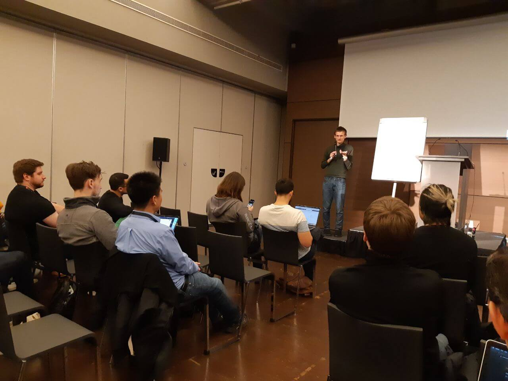
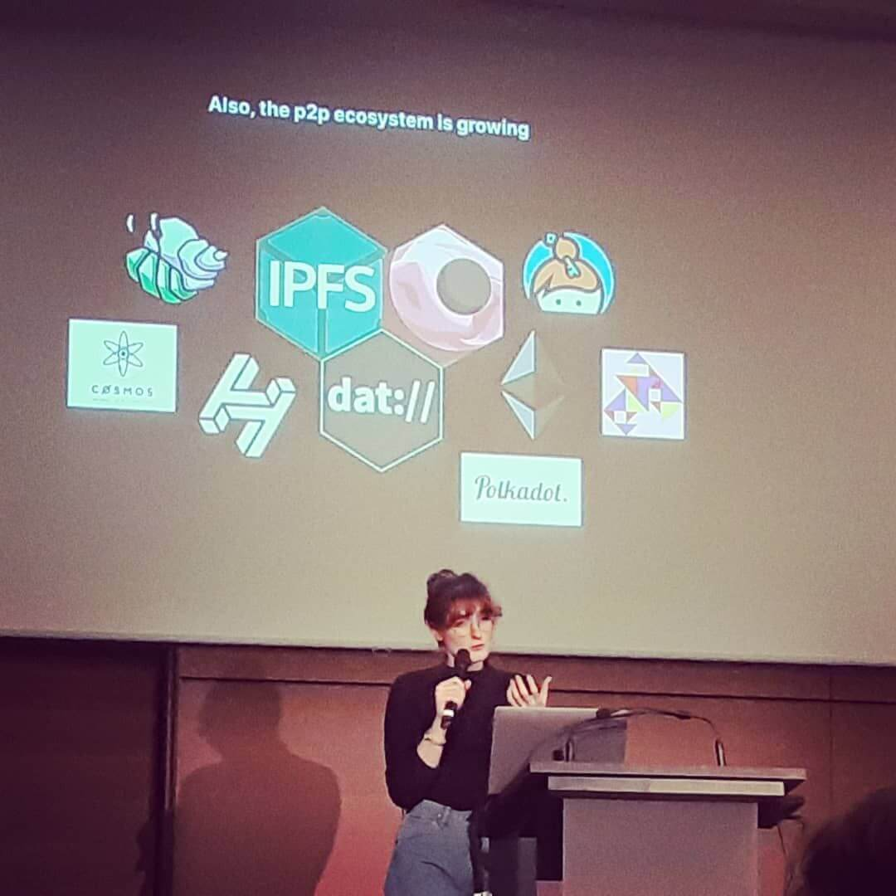
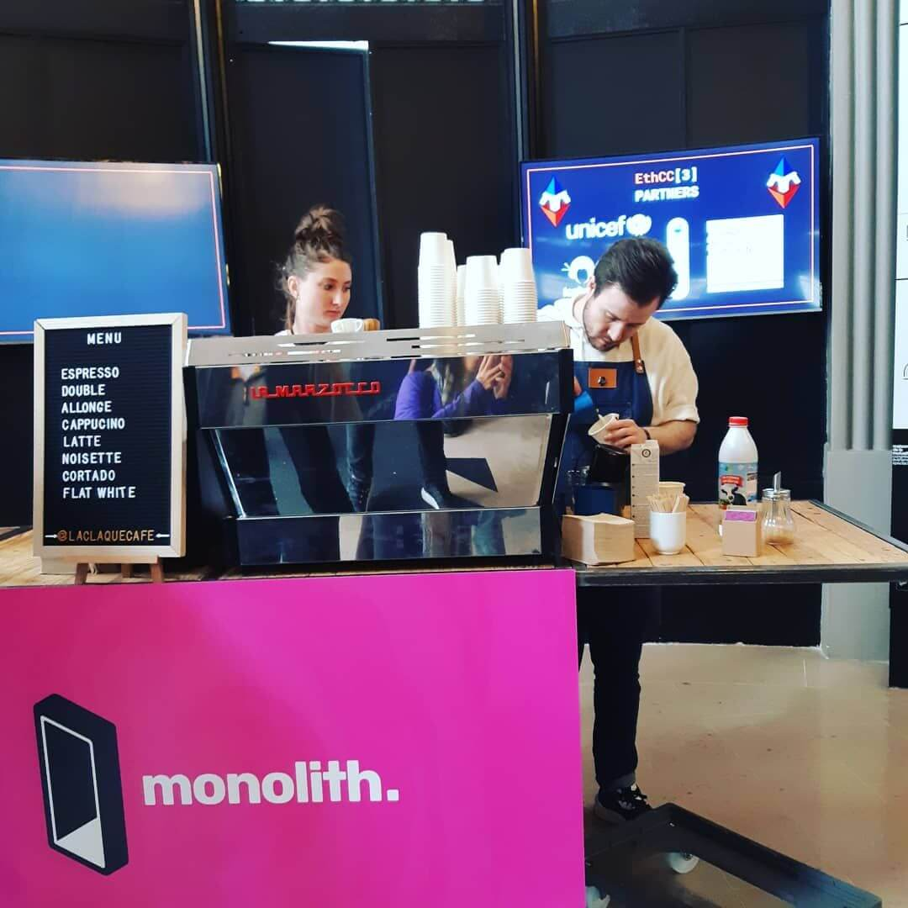
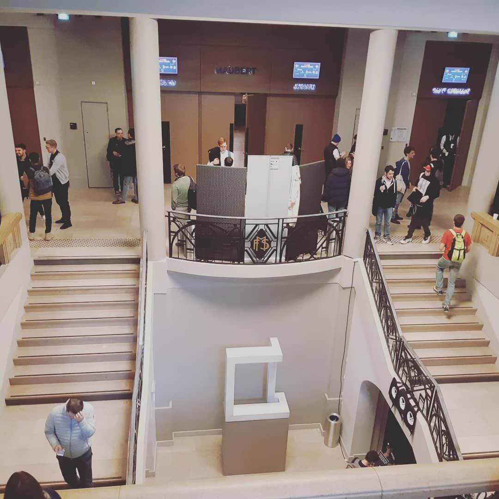

This month, the Diode team spent a week in Paris for [EthCC 3](https://ethcc.io/) event. Here is a recap of some of the most interesting things we have seen.

Hundreds of developers, researchers, investors, and aspiring founders gathered in Paris earlier this month for the third annual [Ethereum Community Conference (EthCC)](https://ethcc.io/index.html). Held in the 5th arrondissement of Paris on March 3-5, CTO [Dominic Letz](https://twitter.com/DominicLetz) and team members were able to connect globally at the forefront of blockchain technology.

At “ETH2REAL WORKSHOP,” a special workshop session curated by Ethereum Foundation Research team, Ethereum creator Vitalik Buterin quickly decided to improvise on his presentation with paper and pen in front of a whiteboard in response to technical difficulties of a projector. The discussions were as effective as it ought to be; the audience were able to engage and understand the hard problems at stake with Vitalik’s professor-like lecturing style.

Abbey Titcomb from the [Radicle](https://radicle.xyz/) team gave a presentation about decentralized code collaboration. (Watch Abbey's presentation on YouTube: [https://youtu.be/wE3BxeBdvzs](https://youtu.be/wE3BxeBdvzs)) It was interesting to hear the speaker talked about [Git](https://en.wikipedia.org/wiki/Git) and [peer-to-peer networks](https://en.wikipedia.org/wiki/Peer-to-peer), her thoughts on open source contributing and collaborating in general, as well as some of the design approaches for decentralized code collaboration. It seems that Abbey has a lot of things going on. Most recently, she was the moderator and organizer of [Sustain Web3 Summit event](/diode/Highlights-of-SustainWeb3-Event-in-Denver-Colorado-20060/) which took place in Denver, Colorado during [EthDenver](https://www.ethdenver.com/) week in mid February.

Another interesting presentation was delivered by Mikerah from Toronto, Canada. She talked about validator privacy issues in Eth 2.0. Watch the presentation on YouTube: [https://youtu.be/WC0GPPZ-qVg](https://youtu.be/WC0GPPZ-qVg) Mikerah discussed this topic in detail in a recent research post “[Exploring a hybrid networking architecture for improved privacy in ETH2.0](https://ethresear.ch/t/exploring-a-hybrid-networking-architecture-for-improved-validator-privacy-in-eth2-0/7207)”.

Unfortunately, we later learned that at least 18 EthCC attendees tested positive for COVID-19. Our team members who went to the EthCC event did a 14-day home quarantine right after. We hope you all stay safe and stay healthy!

The Diode team will be hosting virtual meetup events in the coming months. So, for those who are looking for something fun to do, stay tuned! Follow our [Twitter](https://twitter.com/diode_chain) and join our Telegram group to get the latest updates.
