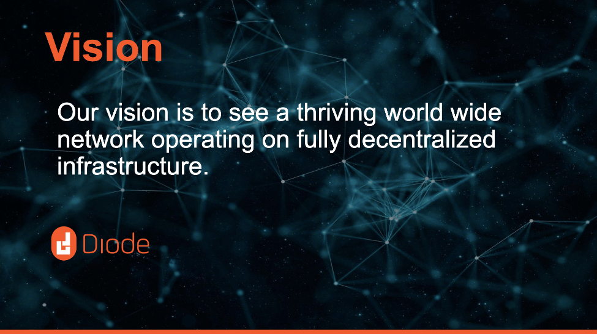
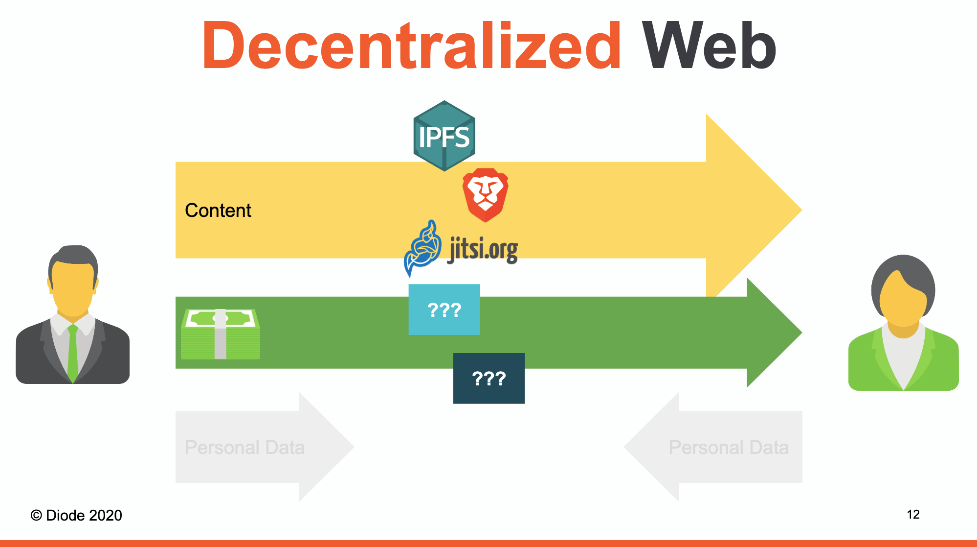
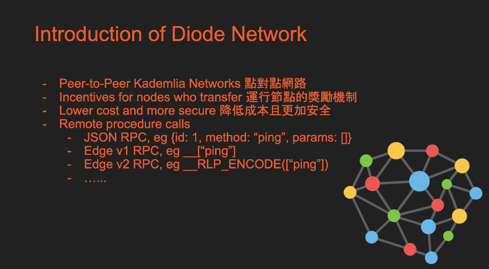
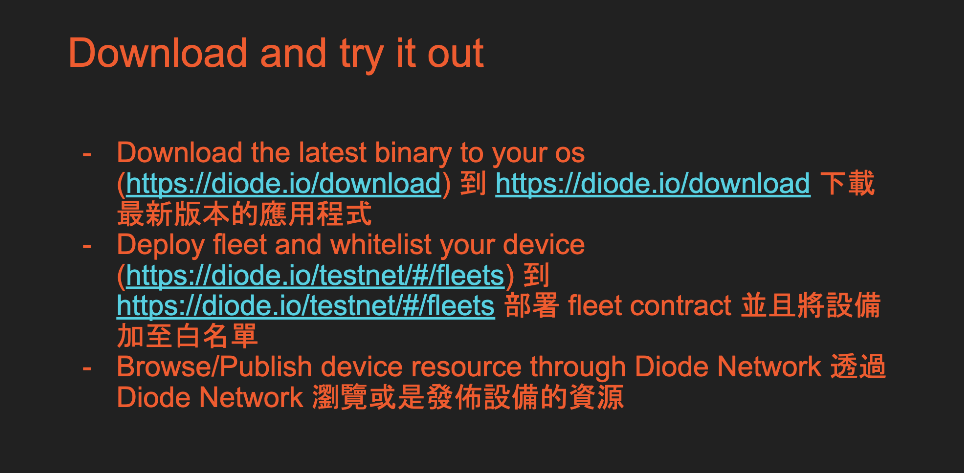
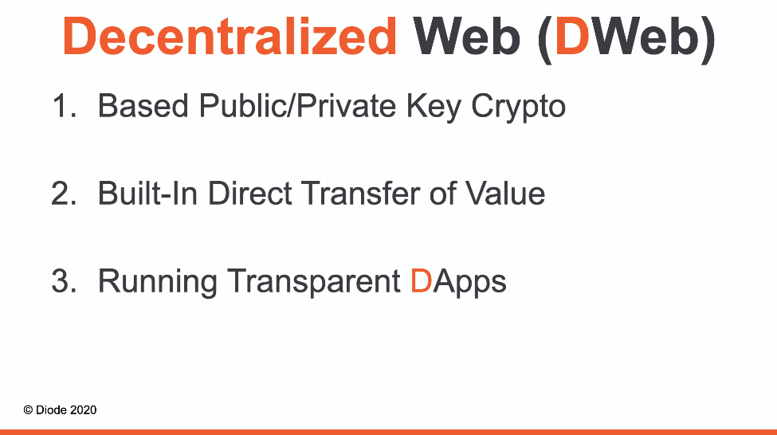

Diode’s first livestream event went live on Monday, April 27, in Taipei, Taiwan. The 2.5-hour online meetup drew more than 30 engineers, developers, makers, and community leaders. Below are some highlights from the event, which was moderated by Raspberry Pi Taiwan group leader Hsu, the featured speaker was Dominic Letz, CTO of Diode. 

<iframe width="560" height="315" src="https://www.youtube.com/embed/KeIwchX_C40" frameborder="0" allow="accelerometer; autoplay; encrypted-media; gyroscope; picture-in-picture" allowfullscreen></iframe>

Watch Dominic’s talk on [YouTube](https://youtu.be/KeIwchX_C40). Diode's presentations slides are now publicly available on [Github](https://github.com/diodechain/presentations/tree/master/Raspberrypi_Taipei_Meetup_2020).

At the event, Dominic talked about a desired future of a fully decentralized infrastructure and how we could make it a reality. 

Dominic stressed the importance of building decentralized web infrastructure. The Web3 ecosystem is growing. There are a lot of players making key contributions to the Web3 movement, such as [IPFS](https://ipfs.io/), [Brave](https://brave.com/) web browser, and [jitsi.org](https://jitsi.org/).

Diode blockchain engineer Peter gave a [presentation](https://github.com/diodechain/presentations/blob/master/Raspberrypi_Taipei_Meetup_2020/Diode%20Meetup%20%231%20April_%20Diode%20Network%20and%20Video%20Streaming%20Using%20Raspberry%20Pi%20Zero%20W.pdf) on Diode Network and video streaming using Raspberry Pi Zero W. Peter also did a quick demo towards the event of the talk, showcasing what it looks like to perform video streaming over the Diode network using Pi.

We’ve got a lot of questions from the audience asking about possible applications for the Diode network. An engineer asked about applications for small-scale agriculture projects. There are lots of things you can do. 

The most straightforward thing would be monitoring connected devices over the Diode network. So, say if you set up greenhouse monitoring on your Pi, you can use the Diode network to monitor and control your device securely anywhere in the world. You can use the Diode gateway at “yourname”.diode.link to showcase your solution to everybody without requiring a server.

Another question we got was how are we different from other existing blockchain protocols in the Web3 ecosystem.  We are seeing a lot of players in the ecosystem doing great work developing frameworks for building blockchains. But Diode has a different approach.

Diode is a blockchain which empowers developers to build data applications on top and build a better Internet. If you want to compare Diode with other existing projects, the closest ones would be dat-protocol, Ethereum-Swarm, and IPFS. 

The difference is, IPFS for instance, only works with pre-hashed files. So live-streaming and web conferencing for example, would not work on IPFS. Diode, on the other hand, is a general network layer. It is designed to work for all kinds of network applications.

The Diode team recently released [pre-built downloads](/download//) for Linux, Mac OS, Windows, and Raspberry Pi (ARM). We invite everyone to give it a try! If you are using a Mac computer, for example, what you can do is download the Mac OS package, create a new fleet ([https://diode.io/prenet/#/fleets](https://diode.io/prenet/#/fleets)), add your client ID, use the “diode socksd” command to run a socks proxy into the Diode network. 

You can view assets on the Diode Network on [https://diode.io/prenet/#/dns](https://diode.io/prenet/#/dns). Once it is up and running, you can run the client in publish mode to create your own dynamic content, such as video streams, IoT sensor data, and websites.

Thanks everyone for coming to the event! We will be hosting another online event this month, and we hope to see you again! In the meantime, view a recent [Medium story](https://medium.com/@hansr77/direct-interaction-with-a-decentralized-blockchain-network-4152492a33da), written by Diode CEO Hans, on direct interaction with a decentralized blockchain network - an overview of the centralized trust problem of decentralized blockchain. 

Check out a [how-to guide](https://medium.com/@hansr77/browse-web3-content-without-centralized-tech-dad508b91a13) of how to browse distributed Web3 content using Diode network without requiring any centralized trusted technology.