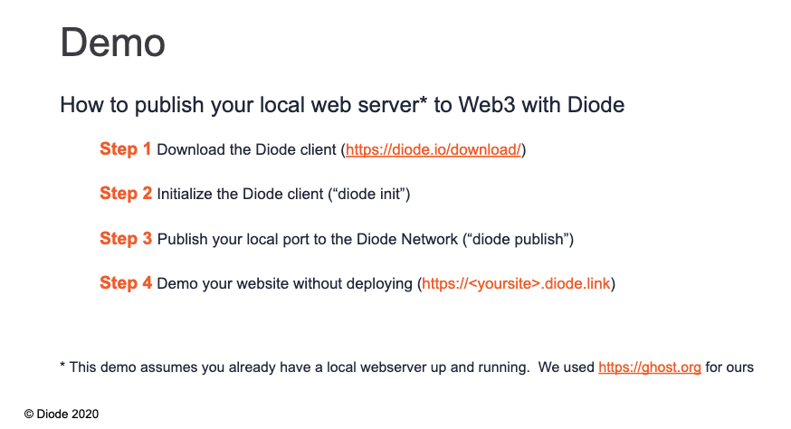
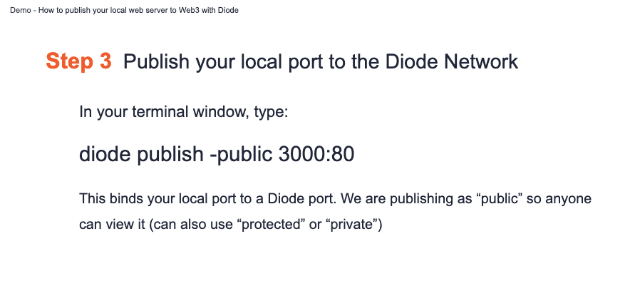
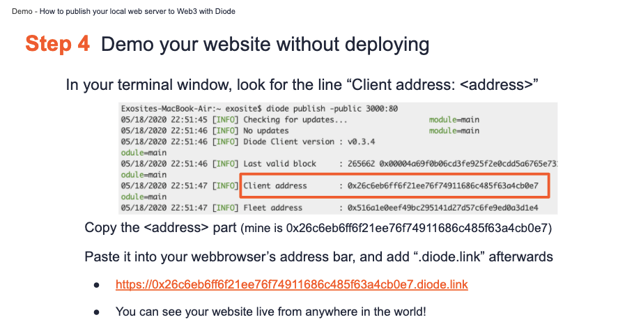
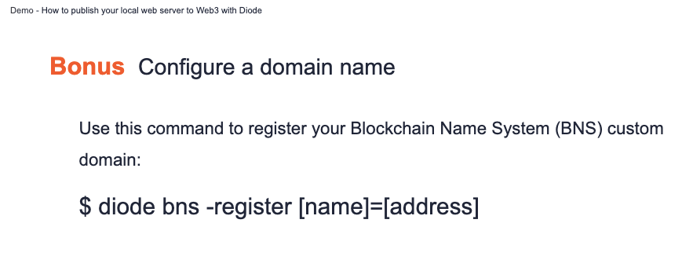

On Tuesday (May 19), Diode’s highly anticipated live streaming event went live. The 30-minute online meetup event drew more than 35 engineers, developers, makers, and community leaders across the globe. CEO Hans Rempel, CTO Dominic Letz, blockchain engineer Peter Lai, marketing manager Yahsin Huang gathered together remotely to discuss some current and potential applications of the Diode's peer-to-peer network. 

<iframe width="560" height="315" src="https://www.youtube.com/embed/B-YzxaKpEJQ" frameborder="0" allow="accelerometer; autoplay; encrypted-media; gyroscope; picture-in-picture" allowfullscreen></iframe>

We gave a demo of Diode client showcasing how to easily publish a local webserver to Web3 with Diode. We wanted to talk about this specific use case in part because we believe privacy and freedom of speech are core values. The Web3 ecosystem is growing; we hope content creators will benefit from being able to publish website content to Web3 without having to provide personal information.

Watch Diode Tuesday online meetup on [YouTube](https://youtu.be/B-YzxaKpEJQ). Presentation slides are now publicly available on [GitHub](https://github.com/diodechain/presentations/blob/master/Diode_Online_Event_May_2020/Diode%20Tuesday%20Online%20Event_%20Publish%20Your%20Local%20Web%20Server%20to%20Web3%20with%20Diode%20May%2019%202020.pdf). Download Diode Client on our [website](/download/#cli).

In the demo, we used a Ghost website as an example. [Ghost](https://ghost.org/) is a popular modern open-source publishing platform. It’s beautifully designed and easy to use. So, we've got a Ghost blog running on a local computer; the audience could access the blog via the Diode network. 

__Note: since we didn't modify the header from http proxy request, and Ghost API will validate whether the host is equal to the url in configuration, you should use http:// instead of https:// in the url configuration.__

It was something interesting to developers, because for app developers, or web developers, there would be times when you need to demo your work. But you would like to demo it without actually deploying. For developers, it would be perfect if you are able to give a URL to anyone. And that URL would allow them to try out the website you’re building without doing any deployment. Diode is really great for that. So, you wonder, where do I Start?

First, you need to download Diode client. You can download Diode client from our website: [Download](/download/#cli). Or, you can build it from source: [https://github.com/diodechain/diode_go_client](https://github.com/diodechain/diode_go_client).

Once you've got it downloaded, you need to initialize it. To initialize your Diode client, open a terminal window and type: `diode init`

This does two things for you: It deploys a new Diode fleet contract (a blockchain smart contract that manages permissions); it whitelists the identity of your client (client address) in the Diode fleet contract.

If you visit Diode’s [prenet website](/prenet/), you can see a list of Diode fleet contracts that are already created. Fleet contracts are strings of letters and numbers. 

Diode's fleet contracts manage a whitelist of identities (public keys) of clients who can communicate with each other. They have an API to configure secure communications: client registration, client deregistration, protected or private connections, and other functions. 

Protected resources are set in Diode’s fleet contracts (“protected” is governed by the fleet contract whitelist); private resources are set in your local machines (“private” is setup by the command).

Here comes an important step to follow. So, once you've got Diode client up and running, what you can do is you can publish your local port to the Diode network. 

In your terminal window, type: `diode publish -public 3000:80`  

So, this binds your local port to a Diode port. We are publishing as “public” so anyone can view it (can also use “protected” or “private”).

Now that you've published your local port to the Diode network, you can demo your website using diode.link url.

In your terminal window, look for the line “Client address: <address>”. Copy the <address> part. Paste it into your webbrowser’s address bar, and add “.diode.link” afterwards. You can see your website live from anywhere in the world!

You can also configure a domain name if you like. Your website address can use a human readable name. Go to Diode's [prenet website](/prenet/#/dns), register your Blockchain Name System (BNS) custom domain. It requires [MetaMask](https://metamask.io/).

You can also register your Blockchain Name System (BNS) custom domain using a command line. Use this command to register your Blockchain Name System (BNS) custom domain:

`diode bns -register [name]=[address]`

One question asked whether it was really necessary to do it with blockchain technology when the existing tools already pretty available to developers today. Founder and CEO Hans Rempel suggested that it was certainly not necessary, "but there are advantages that we think will make this specific use case more attractive than the ones on the market today". 

Three of the immediate feature adds vs. other solutions are: you can publish content to a globally unique “domain” name of your choice, it's free, and if you want to limit access to just a few viewers, you can do that regardless of the IP they are on. 

Furthermore, because the tech is fully decentralized, it also has benefits for privacy. If a person wanted to publish a website - as a dev tool for localhost development, or as a long term site - they can do so with the only information about the website (other than its content) being the Diode address (just like an ETH public address).  No ICANN registration, personal details, etc….

Diode’s vision is to see a world wide network operating on fully decentralized infrastructure. We believe that blockchain, the technology behind Bitcoin, is a potential game changer, not only in the financial world but also in the Internet of Things (IoT) world. 

Hans recently wrote a simple guide showing how to join the growing number of content creators who are publishing their content on Web3 without any centralized technology on Medium. Check out his [Medium story](https://medium.com/@hansr77/publish-your-localhost-website-to-the-internet-without-centralized-tech-16ea9e15f8ba). 

Finally, the pre-built downloads for Linux (including one for Raspberry Pi), MacOS, and Windows are here! The latest version 0.3.4 was released this week. We invite you to give it a try! We'd be thrilled to hear your thoughts and comments.

