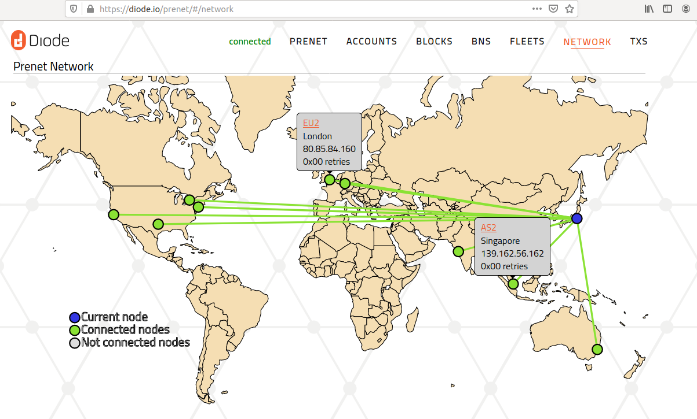
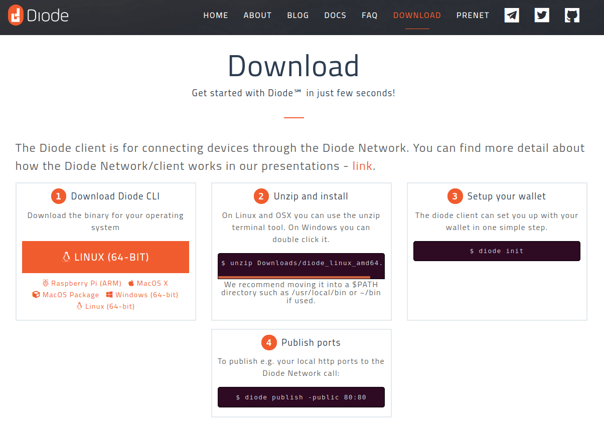
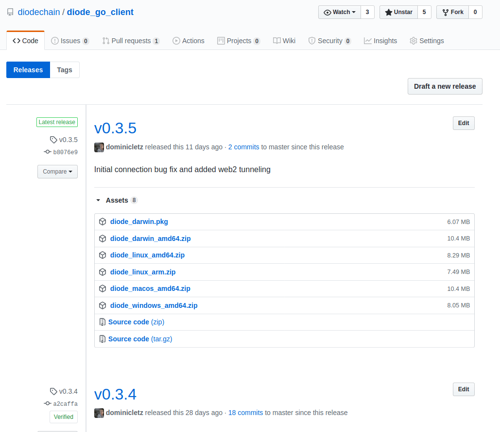
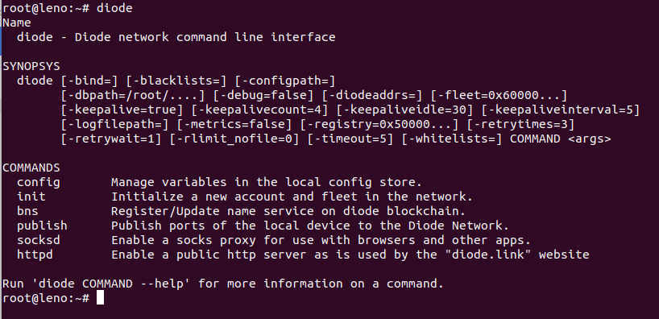
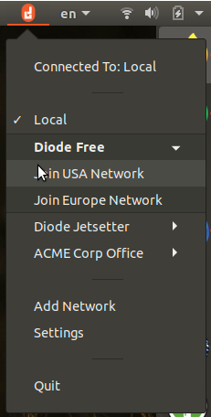
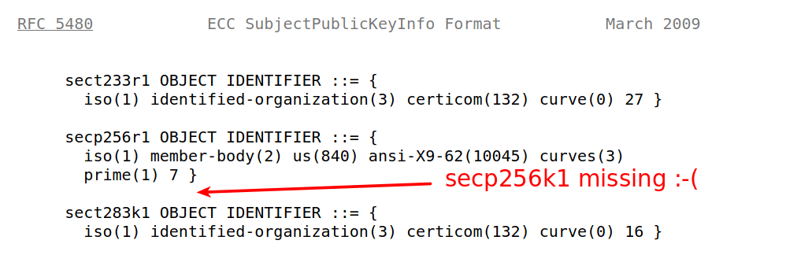
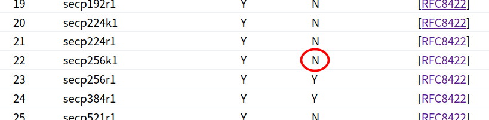
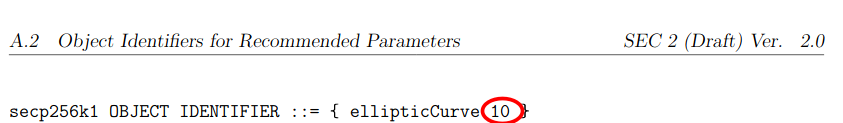
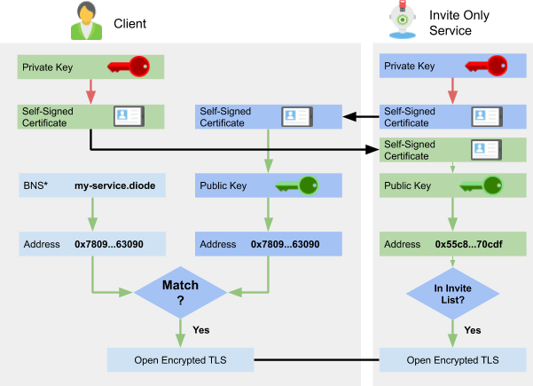

Since our last development update in February we're now just getting over the extended periods of Covid forced home-office. While our [Taiwan office](https://pi-taipei.diode.link/) was only little affected by Covid19 and has had business as usual since quite a time. In our German office we're just returning now to a somewhat normal. Hope you guys are all well - keep safe. That said, let's have a look at the development we got done in those last months. It's actually plenty...

## Roadmap Update

### Network Growth

We have been working more on visualizing our growing mesh network and better tools to inspect the network behavior. On the prenet browser you can now find [the network tab](/prenet/#/network) that displays information on the current network nodes and their connectivity. 



### CLI Usability

As the Diode overlay network becomes more mature we have started making the network easier accessible for concrete use cases. Currently the [Diode command line client](https://github.com/diodechain/diode_go_client) is the primary way of interacting with the network. So time went into making it easier to use and easen the installation process.

*   Most importantly there are now **regular binary releases** that you can [download from our homepage](/download/) or from [GitHub directly](https://github.com/diodechain/diode_go_client/releases) for all three major platforms Linux, macOS and Windows.





*   Secondly there is an easy setup **installer script** for Linux and macOS, and Windows installations with a bash terminal. `curl -Ssf https://diode.io/install.sh | bash` will install the client into your machine
*   Third, we have changed the compilation of OpenSSL so that the **application is packaged into a single file**. This makes updating the application easier and removes problems users had with missing or misplaced dependencies. This change will be rolled out with version v0.3.6
*   Fourth, the command line **flag documentation** has been updated to fit on a single page and be easier consumable. 



*   Fifth, the command line client received a **new command `diode init` to get started**. This allows easy setup without the need to use MetaMask and a Browser to interact with Web3 Smart Contracts before getting started.
*   Sixth, the command line client received another **new command `diode bns -register myname=0x1234` to register BNS names**. This allows writing automation scripts which deal with the BNS registry and setup new deployments quicker.
*   And finally the client received an **auto-update functionality** that will keep it up-to-date and install newer versions as they become available.


### Feature Updates

But that's by far not all, under the hood we've also seen improvements to the core infrastructure as well to support more use cases:

*   The diode client can now be used to **forward udp packets** too. This works both via the already supported SOCKS5 proxy, and through the new bind command. So can a udp tunnel be created to any Diode address and bound to a local port using the flag `-bind=<localport>:<destination>:<dstport>:udp`
*   We have also added preliminary data compression support to the edge protocol and clients, but this has not yet been enabled. We want to give it more testing before applying to all connections.
*   The Diode network traffic has always been encrypted between clients and servers, but with our newest client update the clients are adding tls based **end to end encryption** for connections between two clients. Currently this is still in [code review](https://github.com/diodechain/diode_go_client/pull/28) but it will become the new default.
*   Finally we have been adding **broadcast channels** to fleets. This allows a fleet contract to sponsor true broadcast communications inside their feet to implement presence mechanisms. This is a network enablement at this time but will be used with a couple of future use cases we have in mind. Stay tuned!

### Diode UI

Finally based on our feedback we have started working on a graphical desktop application for the Diode. This is to complement the command line diode client that is used on IoT devices without graphical interfaces. We're still at the very beginning of this journey but plan to ship initial versions soon to make accessing the network even easier.



This is all for now from the Roadmap for now, and as you might feel there are a lot of interesting releases just around the corner in the coming weeks.

### P.S. Diode TLS

Just haven't had the time to describe our usage of [TLS](https://en.wikipedia.org/wiki/Transport_Layer_Security) for end-to-end encryption anywhere else. So here a short note. To my knowledge we're the only team in the crypto space using pure proven TLS encryption for e2e security. While others have chosen to roll-your-own such as [Ethereum and in the process discover flaws in their new implementation](https://github.com/ethereum/devp2p/blob/master/rlpx.md#known-issues-in-the-current-version). Instead we wanted to use the existing proven TLS technology but stay compatible with Ethereum public/private key algorithms based on [secp256k1](https://en.bitcoin.it/wiki/Secp256k1). The cool thing about TLS 1.2 is in fact that it does have **optional support** for our beloved Ethereum/Bitcoin curve. The optional is important here - as we will see in a bit. Unfortunately the [RFC5480](https://tools.ietf.org/html/rfc5480#section-2.1.1.1) that defines Elliptic Curves for TLS Certificates (X509) does not specify an encoding for secp256k1. It's missing in their list:



But this is not intended to be a complete list as with many lists in TLS there is an official registry that allows submitting more entries. And this is where we get the first bit of good news. We can find [secp256k1 in the official IANA Named Curve Registry for TLS](https://www.iana.org/assignments/tls-parameters/tls-parameters.xhtml#tls-parameters-8) but alas in that listing we can also see that it's not marked as recommended:  



This doesn't mean that it's unsafe. It just means that it's not reviewed by the board and hasn't been recommended to be part of every TLS implementation. And as it turns out this means that there are many TLS implementations that unfortunately do not support secp256k1 - This includes the **golang native TLS implementation that does unfortunately not support secp256k1**. There is an [issue about this here](https://github.com/golang/go/issues/26776). Luckily though OpenSSL on the other hand, the most commonly used TLS library does support the curve secp256k1. [Based on the sec2 proposal](http://www.secg.org/sec2-v2.pdf) we can find that they also assigned secp256k1 an encoding number for use in TLS Certificates



And putting this and RFC5480 together we find our identifier for certificates using secp256k1 public keys:


```
    secp256k1 OBJECT IDENTIFIER ::= {
       iso(1) identified-organization(3) certicom(132) curve(0) 10 }
```

This is in fact how Diode clients are creating their self-signed certificates. And this is also the reason why we're bundling OpenSSL with our reference Client and are using it on the other side on our reference Node implementations. We hope that in the future there will be more TLS libraries supporting secp256k1 natively. Secp256k1 being the fundamental crypto primitive both in Bitcoin and in Ethereum this would be great for the whole crypto community we believe.

#### Making Connections

With all that in place we can now open TLS encrypted connections between two machines using secp256k1 certificates. In the Diode network we do not need any certificate hierarchies, but instead we only use certificates to ensure that we're talking to the person we're thinking we're talking to. For this there are four important elements:

*   Private Key	- The secret that you never share
*   Public Key	- The public key that TLS is identifying you by
*   Address	- The Ethereum Address you're known by
*   BNS Name	- Blockchain Name Service Name, mapping a name to an Address.

In the Diode network clients can explicitly create connections by providing an Ethereum Address such as 0x780980bfc0aa56ceb1417e87912e54b759463090.diode or alternatively a BNS name pi-taipei.diode as indicated by ***** on the diagram. Clients using Diode are enabled to check the identity of their communication counterpart by extracting the public key from the self-signed certificate that they receive and hashing that into an Ethereum Address. So every network user's wallet turns into an unforgeable identification mechanism. Be it human users or robotic network participants. This check can be made in both directions. Below is a flow diagram showing how this check could look like when a user wants to to use an invite only service.



In this diagram we can see that both the User (Client) and the Service are checking authenticity. The “Invite Only Service” has a pre-approved list of invitees that is used to check if he allows communication. The Client on the other hand already knows the BNS name “my-service.diode” and is using that to resolve the address and check whether the answering service identity is corresponding to the address that it should be. All of this is of course happening behind the scenes and transparent for the user.

Let us know if you have any questions on our [twitter channel](https://t.me/diode_chain) or via [GitHub issues](https://github.com/diodechain/diode_go_client/issues), we're happy to discuss more on this approach.
