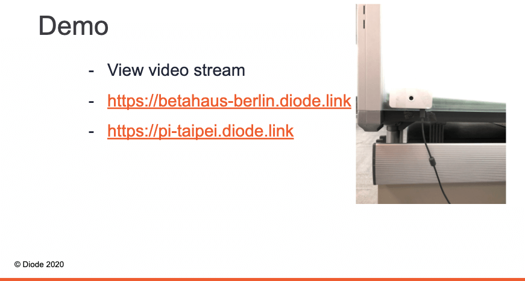
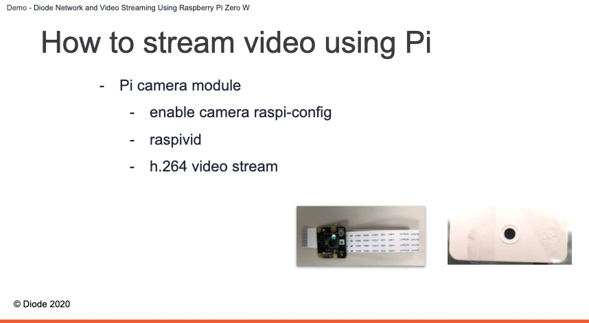
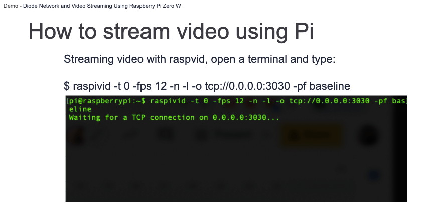
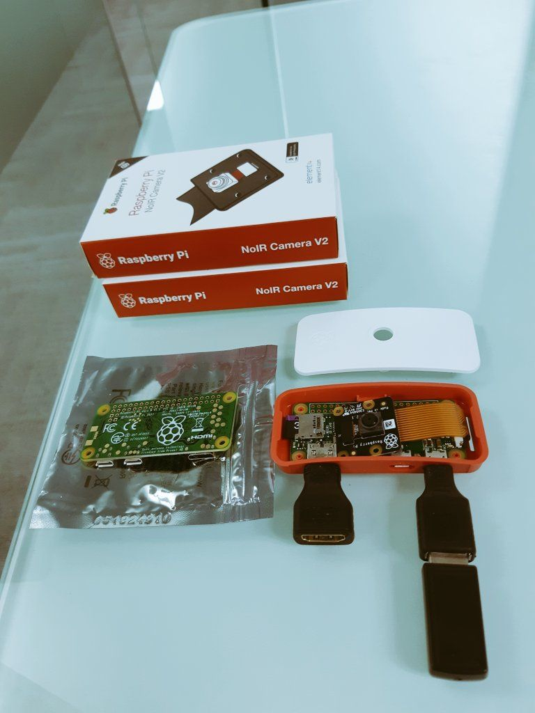

Diode’s second livestream meetup event went live on Tuesday (June 30). The 30-minute online event drew some 20 engineers, developers, makers, Raspberry Pi enthusiasts from countries across the globe. CTO Dominic Letz and blockchain engineer Peter Lai were the featured speakers. 

The meetup topic was about how to perform video streaming using Raspberry Pi Zero W via Diode network. Check out the Diode meetup presentation slides on [Github](https://github.com/diodechain/presentations/blob/master/Diode_Online_Event_June_2020/Diode%20Tuesday%20online%20event%20%232_%20Diode%20Network%20and%20Video%20Streaming%20Using%20Raspberry%20Pi%20Zero%20W.pdf). Watch the livestream-ed meetup on[ YouTube](https://youtu.be/4VnDFfqQl3w).

<iframe width="560" height="315" src="https://www.youtube.com/embed/4VnDFfqQl3w" frameborder="0" allow="accelerometer; autoplay; encrypted-media; gyroscope; picture-in-picture" allowfullscreen></iframe>

Peter started his presentation by giving a quick demo. We’ve got a Raspberry Pi set up at our office in Berlin, Germany (where Dominic is currently based), and another Raspberry Pi set up at our office in Taipei, Taiwan. 

The demo we showed was about how you can get to see the pi-taipei real-time camera video streams served via Diode network anywhere in the world. With Diode, you are able to broadcast it to multiple clients. The real-time data streaming and buffering are done over the Diode network.

To get the Raspberry Pi video streaming started, you will need to attach the camera module to the Raspberry Pi board. The picture on the left is the camera module; the picture on the right is the Raspberry Pi Zero that we have set up in our office in Taipei.

The next step is to enable the camera. Make sure the camera is enabled. Go to your Terminal and type in command sudo rapspi-config, choose Interface Options to enable the camera module on your Pi.

Once you’ve enabled the camera support, what you can do is you can do the video streaming using Raspberry Pi. So open terminal and type `raspivid -t 0 -fps 12 -n -l -o tcp://127.0.0.1:3030`. I’m using 0.0.0.0 instead of localhost for demo purposes. Because the data is not encrypted, there may be some security risks for users, so we don’t recommend it.

Then you can open vlc or mplayer to play the video stream. We’re using mplayer in this demo: `nc [pi’s]ip 3030 | mplayer -fps 12 -demuxer h264es -cache 1024 -`. This is the screenshot that we took with the Taipei Raspberry Pi. Note that raspivid only allows one client to connect.

So we’ve got the streaming setup on our Pi. Here’s an important step to follow. We can now publish the video streaming through Diode Network. Why would you want to do that? Because we use TLS encryption. It’s more secure for users. And we have broadcast functionality, so that you can provide video streaming to multiple clients at the same time.

You can go to our website’s download page, and download Diode client’s the latest binary file for your Raspberry Pi. You can also download the Diode client by using the curl command on Pi. If you are more of a pro, Diode is an open source software, you can clone and build it from our [source code](https://github.com/diodechain/diode_go_client).

Once Diode is set up on Pi, you can open Terminal and type diode publish -public 3030:3030 to publish video streaming to Diode Network. You can use our diode_poc_website to play with the video streaming in a web browser (which is what we showed in the demo.). 

We have bundled and released the files of diode_poc_website. Go to our github release page and download it. Note that you have to host the website first. Choose your favorite web host service, for example, Apache, lighttpd, Nginx. You can use rsync or scp command to upload the diode_poc_website to Pi.

We’ve collected several questions prior to the event and provided answers during the discussion session.

Q: How to compile binary files on a Raspberry Pi in a more efficient way?

Cross-Compiling is a common way to compile binaries on your machine and copy them to the Pi. There are tutorials for different languages. For instance, for C/C++ check out this [article](https://blog.kitware.com/cross-compiling-for-raspberry-pi/). For Go, check out this [post](https://www.thepolyglotdeveloper.com/2017/04/cross-compiling-golang-applications-raspberry-pi/). For Rust, check out this [article](https://dev.to/h_ajsf/cross-compiling-rust-for-raspberry-pi-4iai)

Q: Is the video streaming content stored on Diode’s blockchain network?

No, the Diode network is a peer-to-peer relay network which transmits the streaming content. In the Pi video example, we were using a shared port to broadcast the video data live to all participants. The blockchain miners help duplicating the content and sending it to as many receivers as needed. So the Raspberry Pi only needs to stream to one client, but the video can be sent to thousands of viewers at the same time.

Q: One common way to do Raspberry Pi’s video streaming via TCP is to use the “raspivid” command. How is Diode different from this commonly used command? 

Diode adds to the “raspivid” command three superpowers: \
1) Global reachability under any http://&lt;name>.diode.link domain  \
2) Broadcast to hundreds or thousands of video watchers \
3) Access control using Ethereum ids (public, protected or private stream)

Q: I’m a podcast host. Is it possible to publish my podcast to Diode?

Yes, you can certainly publish your podcast with Diode. A major difference between Spotify and Diode is that when uploading content to Spotify, the Spotify company owns your content; therefore, they can easily sell ads, and get profits out of your content. But if you do it with Diode, you still have the ownership of your content. Diode doesn’t own your content, hence can’t make money from your content. However, in order to publish your podcast with Diode, you have to first put the podcast on a Diode-enabled host (see our [post](https://medium.com/@hansr77/publish-your-localhost-website-to-the-internet-without-centralized-tech-16ea9e15f8ba) on Ghost). In order to make that easier in the future, we would like to invite application developers to create applications like this that leverage Diode’s decentralized publisher-first network!

What is more interesting is if you do a live program, for instance, a live broadcast episode with Diode, I would recommend: 1) Live broadcast your podcast via Diode; 2) After broadcast, upload it to Spotify / etc. for people to listen to it later

Q: For Raspberry Pi users, why would you want to use Diode network when you can easily use “ssh” over a local network?

With Diode, the user can “ssh” to the Raspberry Pi from anywhere in the world. We’re actually doing this regularly to debug our Raspberry Pis in Taipei, Berlin and at home. We can easily login to any of our Pis from anywhere on the planet using Diode. 

Diode’s vision is to see a world wide network operating on fully decentralized infrastructure. We’d like to invite you to join the Web3 movement and build great decentralized infrastructure with us! Check out CTO Dominic Letz’s recent write-up on the [development updates](/diode/Diode-June-Update-20168/).
