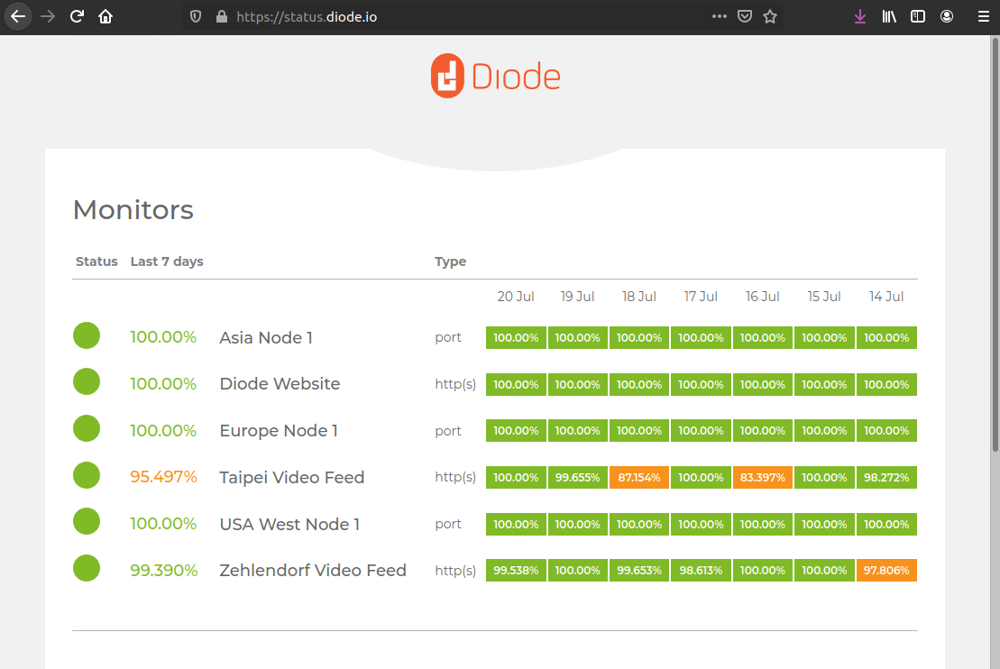
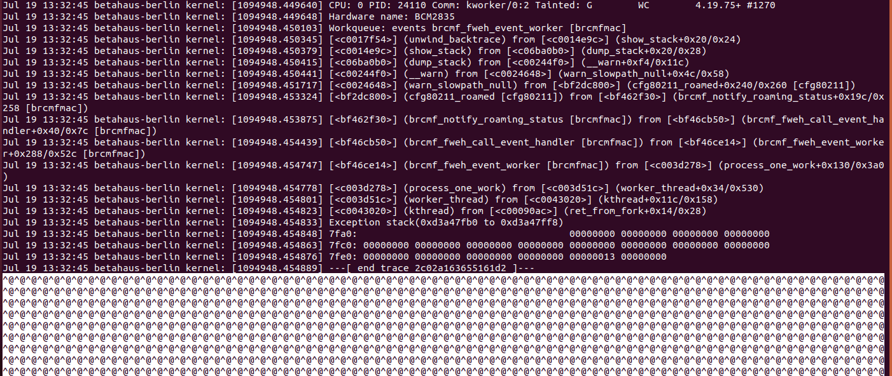
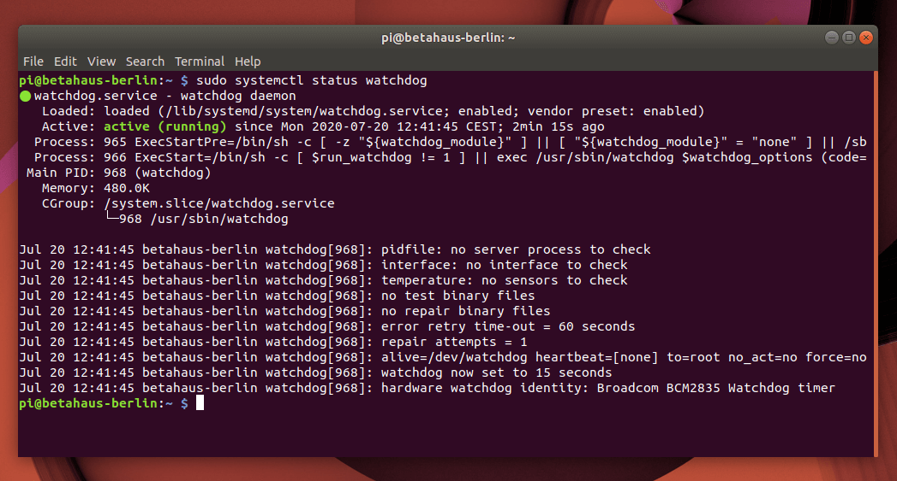

At [Diode](https://diode.io) we have deployed a couple of long-running Raspberry Pis equipped with cameras and sensors reporting into our network 24/7. All these are under uptime monitoring for us to keep track of the network availability. Every time there is a software problem we want to know it. For that we're using some external and internal tools. 



Eventually we have run into a problem not related to our software. From to time one of our Raspberry Pis freezes in the field either because of a kernel or a hardware issue. In that case there is nothing that can be done with software anymore. You can't connect to it, can't ping the Pi -- It becomes impossible to send it a restart command in any way to bring it back to normal operation. Debugging into these events you might find indications of such as freeze in the _/var/log/kernel.log_ file. Below an example of a freeze that first shows a kernel exception and then just garbage _^@^@^@^@^@_



That's the point the Pi froze, and only manual powering down, and powering up again brought it back to live.

## Enter Watchdog

But the Pis are very resourceful tools. And one of their underdocumented features is a builtin hardware watchdog. This little hardware service will _once enabled_ watch the system activity and automatically power cycle the Raspberry Pi once it gets stuck. 

So if you're running your Raspberry Pi as a remote sensor for the Diode Network, decentralized web hosting, or a Diode website — or using it to power Diode Collab secure team collaboration — we recommend enabling this hardware watchdog for maximum uptime.


It's done in few steps directly on a _terminal_ on your Pi:

1) Enable the hardware watchdog on your Pi and reboot

```
sudo su
echo 'dtparam=watchdog=on' >> /boot/config.txt
reboot
```

After this reboot the hardware device will be visible to the system. The next steps install the software side of this to communicate with the watchdog.

2) Install the watchdog system service

```
sudo apt-get update
sudo apt-get install watchdog
```

3) Configure the watchdog service

```
sudo su
echo 'watchdog-device = /dev/watchdog' >> /etc/watchdog.conf
echo 'watchdog-timeout = 15' >> /etc/watchdog.conf
echo 'max-load-1 = 24' >> /etc/watchdog.conf
```

4) Enable the service

```
sudo systemctl enable watchdog
sudo systemctl start watchdog
sudo systemctl status watchdog
```

If everything worked then you should after the last command output similar to this:



Now next time your Raspberry Pi freezes, the hardware watchdog will restart it automatically after 15 seconds. 

If you want to test this you can try running a _fork bomb_ on your shell:

```
sudo bash -c ':(){ :|:& };:'
```
__WARNING__ _Running this code will render your Raspberry Pi inaccessible until it's reset by the watchdog._ __/WARNING__


If you got any troubles with your Pi or running Diode on the Pi feel free to reach out to us on [Telegram and ask questions directly there.](https://t.me/diode_chain)

And if you want to learn more about Diode be sure to check out the [Diode FAQs](https://github.com/diodechain/wiki/wiki/FAQs).

### Update: July 21st 

In some cases our [_Raspberry Pi Zero W_](https://www.raspberrypi.org/products/raspberry-pi-zero-w/) would crash it's WiFi driver but not completely go down. This wouldn't trigger the watchdog, because the device is still running - just not communicating anymore... To handle this case we added one more line to the _watchdog.conf_ configuration file. Like this:

```
sudo su
echo 'interface = wlan0' >> /etc/watchdog.conf
```

With this additional configuration line, the watchdog will also power cycle the Raspberry Pi when the WiFi interface _wlan0_ gets into trouble.

## Use your Raspberry Pi to:

1) [ Host a decentralized website ](https://app.docs.diode.io/raspberry-pi/host-a-public-wordpress-website-on-raspberry-pi/)
2) [ Replace Dropbox / Google Drive ](https://app.docs.diode.io/raspberry-pi/use-your-raspberry-pi-as-a-remote-file-server-backup-device/)
3) [ Be a private chat server ](https://app.docs.diode.io/raspberry-pi/use-your-raspberry-pi-as-a-private-chat-server/)

Ready to deploy reliable Raspberry Pi nodes? Power your Diode Network sensors, host a decentralized website, or run D[iode Collab](https://collab.diode.io/) for secure team messaging and decentralized hosting — all with bulletproof uptime through hardware watchdogs.
