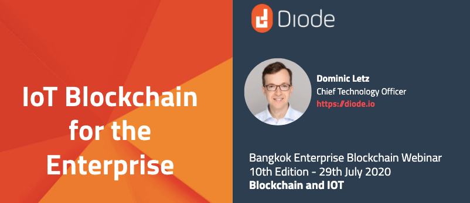
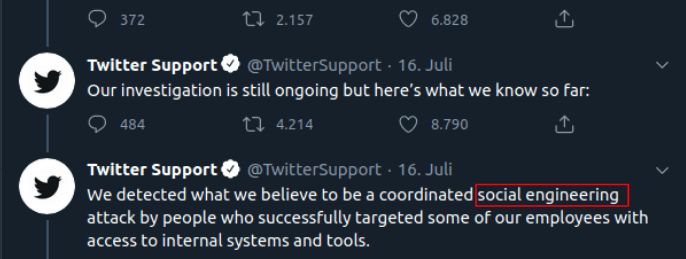
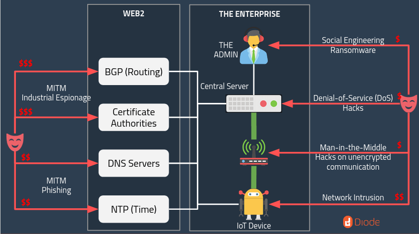
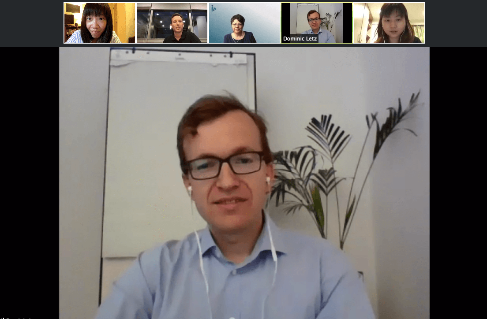

Diode CTO Dominic Letz was invited to speak at [Bangkok Enterprise Blockchain group](https://www.meetup.com/Bangkok-Enterprise-Blockchain/events/271814031/) on Wednesday, 29th of July, along with another speaker Jana Bulkin from Integrationworks Asia. 

Organized by [Atato](https://www.atato.com/), the online event _“Enterprise Blockchain 10th edition: Blockchain and IOT!”_ drew engineers, developers, industry experts and makers from Thailand, Germany, France, Taiwan, and a few from Vietnam. We appreciate Atato CMO Maxime Paul for facilitating and moderating the event.

Check out Diode’s Bangkok meetup presentation slides on [Github](https://github.com/diodechain/presentations/blob/master/Bangkok_Meetup_2020/Bangkok_Meetup_2020.pdf). Watch the livestream-ed meetup on [YouTube](https://youtu.be/tGepc4324xQ?t=2320). Dominic’s presentation starts at 38:40.

<iframe width="560" height="315" src="https://www.youtube.com/embed/tGepc4324xQ?start=2320" frameborder="0" allow="accelerometer; autoplay; encrypted-media; gyroscope; picture-in-picture" allowfullscreen></iframe>

Dominic discussed issues concerning IoT security, and how Diode can play a key role in giving IoT security the upgrade it needed. At Diode, we’ve set up an integrated enterprise solution that is unique to upgrade the security. We’re proposing to replace overreaching admin permissions using smart contracts.

The future of enterprise in terms of security, we think that _the industry needs to rid of "the admin"_ who has super-powers, in particular, the IT admin and often support people who have immediate control of private data. 

Twitter just showed the impact such a social engineering attack can have. It directly led to crypto scam tweets, but haven taken over the Twitter accounts of global leaders much worse could have happened. Similiar just two weeks ago, Garmin was attacked with ransomware. This attack forced their global connected customer equipment to lose functionality. Their global services were down, and Garmin is still in the process of getting everything up again. We saw all of these and previous attacks, and as they get resolved we see how easy they were to execute. In the Twitter case [allegedly a 17-year old was behind this attack](https://www.nytimes.com/2020/07/31/technology/twitter-hack-arrest.html). IT Support was socially engineered to reset customer emails, and thus enabled the takeover. There’s a better way to do this. As an industry we have to react and replace "root" access with multi-signature processes. We have to protect private data better. Security has been the primary driven force for creating the Diode network.

_"The Admin"_ problem is just the peak of the iceberg here, but it is one that is widely prevalent and the easiest to attack. In many companies employees in support and technical capabilities have direct control of critical infrastructure. We believe that only Blockchains have the ability to resolve this finally. A multi-signature smart contract used to control changes, has no backdoor, and no admin who can change values. All other database based solutions even if they implement multi-signature steps on the outside, still have somewhere in the system an admin role who is tasked with maintenance for backup & restore and finally has the ability to make any change.  We're a big believer of _end-to-end (E2E) blockchain_ meaning that there is no middleware that can be compromised, and end-to-end encryption meaning that there is no decryption anywhere in the transport channel. In both areas we're seeing often solution that go half the way. E.g. they start using encryption on the way to the server, but the server can actually read all data. Or we see blockchain deployments in which middleware servers enable the communication. Diode is unique as it's _the only network that implements E2E blockchain_ (even small IoT devices connect directly to the blockchain without middleware servers) and E2E encryption.

## Open Discussion

At the end of the meetup, we had an open discussion with many good questions raised:

__“It (Diode) seems to be an extension of Ethereum for “nano-clients,” is this correct? Is the underlying network the Eth main net?”__

The answer is yes, it is correct. Diode’s BlockQuick is an extension of nano-clients. The required blockheader change is detailed in the [BlockQuick paper](https://eprint.iacr.org/2019/579.pdf). It is not an Ethereum mainnet, but a fork of the Ethereum network that has that required blockheader change.

__“IoT devices are pretty vulnerable to cyberattacks. For instance, they could easily become a victim of DDoS attacks. How are blockchain technologies facing this security issue, and how can blockchain help better solve it?”__

The IoT devices often become victims of DDoS attacks. In the [Garmin case](https://connect.garmin.com/status/), the devices are connected to a couple of central servers. Once the servers are DDoS'ed, the devices are down. In a blockchain network when devices can talk to any node, a DDoS attack on a couple of servers wouldn't do anything. For a DDoS attack to be successful, they would need to bring down 51% of all blockchain nodes. 

In fact with the Diode network, even data routing is only happening when enabled by you. So only devices that you’ve enabled can connect to your services. Using [downloadable Diode client](/download/), you can set this up with a simple command  `diode publish -protected` so unknown, malicious devices won't even be able to DDoS your services, because they can't even reach them.

__“Can blockchain accelerate IoT, how?”__

We think the answer is positive. In fact blockchain accelerates IoT in many ways. First, it can bring your product to market faster, because you don’t have to worry about setting up the Edge, AWS, Azure… servers. Instead, you can have the blockchain scale it for you. 

Secondly, the public Diode routing networks allow you to do a single low-powered IoT device to publish its sensor data to thousands of consumers without increasing the load on the device. This means it is actually accelerating things. 

And lastly, we hope that with technology such as Diode, deploying large amounts of IoT fleets becomes a much easy, and much cheaper task. We look forward to seeing many more deployments and much more security especially from small and mid-tier companies.

__A question asked about our plans to follow Ethereums recent development, such as Eth2.__

We’re definitely watching Eth2 closely. We think the Eth2 development is generally moving toward the right direction and we will be ready to follow Eth2 when it’s working well. 

Diode’s vision is to see a world wide network operating on fully decentralized infrastructure. We’d like to invite you to join the Web3 movement and build great decentralized infrastructure! Check out Dominic’s recent write-up on [Raspberry Pi hardware watchdog](/raspberry%20pi/running-forever-with-the-raspberry-pi-hardware-watchdog-20202/).

