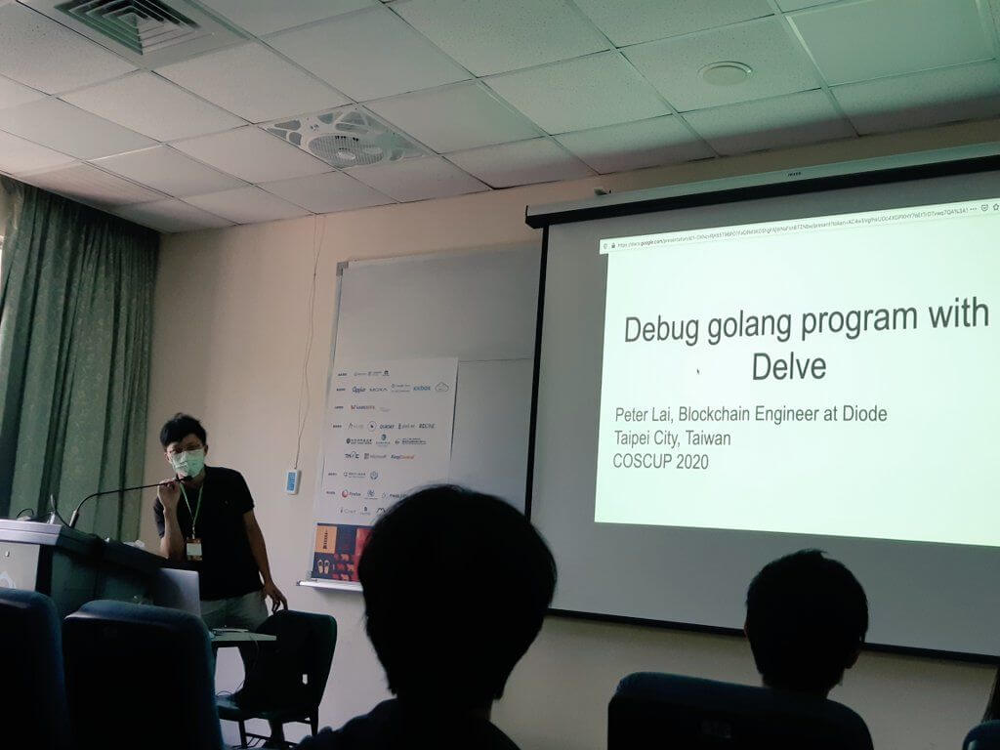
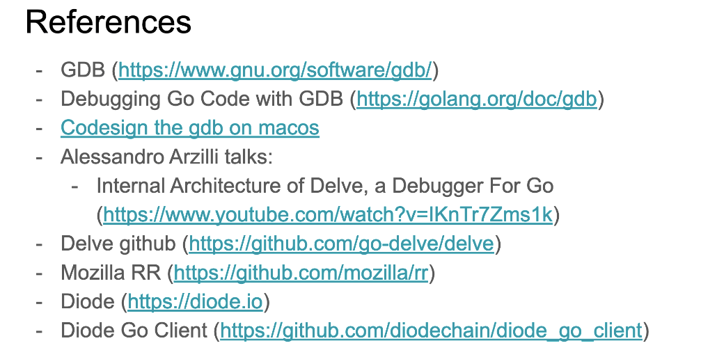
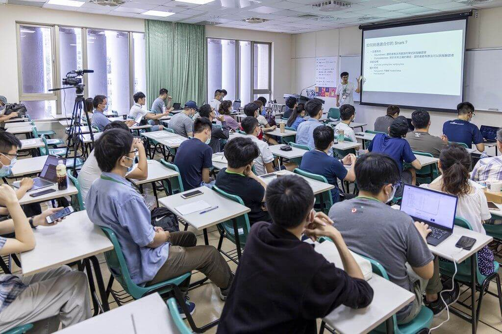

Diode’s blockchain engineer [Peter Lai](https://twitter.com/alk03073135) presented at the Conference for Open Source Coders, Users, and Promoters, or [COSCUP](https://coscup.org/2020/en) -- Taiwan’s largest, most popular open source tech conference on Sunday, August 2. 

The feature image of this blog post is a group photo of Taiwan's Golang community along with audiences from the Effective Go track at COSCUP -- a great shot by one of the COSCUP's professional photographers. More photos uploaded by COSCUP organizers can be found on [Flickr](https://www.flickr.com/photos/coscup/albums).

COSCUP is an annual tech conference organized by a number of Taiwan’s local open source developer groups since 2006. This year’s 2-day conference event took place at the university campus of National Taiwan University of Science and Technology in Taipei City.

The 30-minute discussion, led by Peter as part of the sessions in the Effective Go track, was about some of his recent programming experiences as well as a few of his insights on debugging the Golang program with Delve.

<iframe width="560" height="315" src="https://www.youtube.com/embed/MVcWLd5YbMc?start=133" frameborder="0" allow="accelerometer; autoplay; encrypted-media; gyroscope; picture-in-picture" allowfullscreen></iframe>

Peter’s Debugging Golang Program with Delve presentation slides are now publicly available on [GitHub](https://github.com/diodechain/presentations/blob/master/COSCUP_2020/Debug-golang-program-with-Delve%20.pdf). Watch his presentation at COSCUP on [YouTube](https://youtu.be/MVcWLd5YbMc).

The presentation covered an introduction on how developers can debug with Delve, a brief introduction on how Delve works, debugging Golang programs with Delve, as well as deterministic debugging with Delve.

Another great shot of a blockchain session by COSCUP photographers gathered in COSCUP's [Flickr albums](https://www.flickr.com/photos/coscup/albums).

In addition to participating in the discussions happening at the Effective Go track, we were also part of the discussion at several blockchain-focused sessions. Some of the most interesting discussions were centered around implementing Zero-Knowledge Proofs on Ethereum. 

It was actually our second time participating in this truly amazing open source event. We look forward to continuing our discussions and engagement with the open source communities in Taiwan and the world!