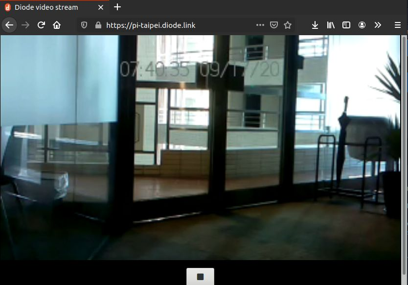

Keeping your Raspberry Pi Video project up and running 24/7 can be quite a task. With the [Diode Client](/download/) you have always access from everywhere and can easily share it's video stream. In our previous Raspberry Pi post we focused on the [built-in watchdog](/raspberry%20pi/running-forever-with-the-raspberry-pi-hardware-watchdog-20202/) to keep survive hardware errors. But what do you do if the video fails on you?

There are different tools you can use to capture pictures from your Raspberry Pi Cam versions 1 and 2. The most common are [raspistill and raspivid](https://www.raspberrypi.org/documentation/raspbian/applications/camera.md). In our demo deployments we're using _raspivid_ to stream the live video to a local port and expose that through [Diode to the public](https://pi-taipei.diode.link/).

The command we use is this:

```bash
raspivid -awb auto -t 0 -w 320 -h 180 -fps 12 \
    -ae 16,0x77 -a 12 -a "%X %m/%d/%Y" -ifx saturation \
    -ex auto  -n -l -o tcp://127.0.0.1:3030 -pf baseline
```



But sometimes we found that the stream would stop and show error messages like this in the logs:

```
@07/25/2020 21:14:20 [EROR] Failed to connect local: dial tcp [::1]:3030: connect: connection refused server=europe.testnet.diode.io:41046
@07/25/2020 21:14:20 [EROR] Failed to connect local: dial tcp [::1]:3030: connect: connection refused server=europe.testnet.diode.io:41046
@07/25/2020 21:14:21 [EROR] Failed to connect local: dial tcp [::1]:3030: connect: connection refused server=europe.testnet.diode.io:41046
@07/25/2020 21:14:21 [EROR] Failed to connect local: dial tcp [::1]:3030: connect: connection refused server=europe.testnet.diode.io:41046
@07/25/2020 21:14:21 [EROR] Failed to connect local: dial tcp [::1]:3030: connect: connection refused server=europe.testnet.diode.io:41046
@07/25/2020 21:14:21 [EROR] Failed to connect local: dial tcp [::1]:3030: connect: connection refused server=europe.testnet.diode.io:41046
@07/25/2020 21:14:22 [EROR] Failed to connect local: dial tcp [::1]:3030: connect: connection refused server=europe.testnet.diode.io:41046
@07/25/2020 21:14:22 [EROR] Failed to connect local: dial tcp [::1]:3030: connect: connection refused server=europe.testnet.diode.io:41046
@07/25/2020 21:14:22 [EROR] Failed to connect local: dial tcp [::1]:3030: connect: connection refused server=europe.testnet.diode.io:41046
@07/25/2020 21:14:22 [EROR] Failed to connect local: dial tcp [::1]:3030: connect: connection refused server=europe.testnet.diode.io:41046
```

And in the logs of `raspivid`:

```
mmal: Failed to write buffer data (228 from 325)- aborting
```

At the same time the camera would indicate with a red light that it's still recording, but no more picture data is coming...


## VideoCore

The Raspberry Pi distribution comes with both the _OS kernel_ as well as a _VideoCore firmware_ for it's camera. This firmware is what can cause this problem.

Luckily it can easily be updated. In our cases we found that just ensuring that the most recent stable version is installed solved for us the red led of death.

And this is what you do on the Raspberry:

```
sudo apt-get update
sudo apt install --reinstall libraspberrypi0 libraspberrypi-{bin,dev,doc} raspberrypi-bootloader raspberrypi-kernel
```

The reinstall option forces reinstallation of the packages which will in turn ensure that the VideoCore firmware is updated in the hardware.

If you got any troubles with your Pi or running Diode on the Pi feel free to reach out to us on [Telegram and ask questions directly there.](https://t.me/diode_chain)

And if you want to learn more about Diode be sure to check out the [Diode FAQs](https://github.com/diodechain/wiki/wiki/FAQs).
