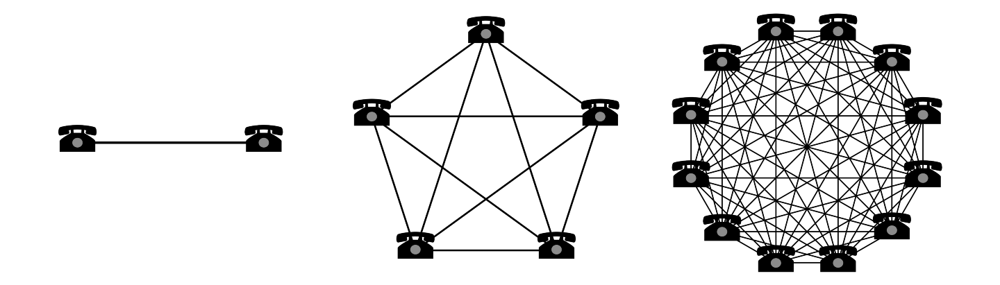
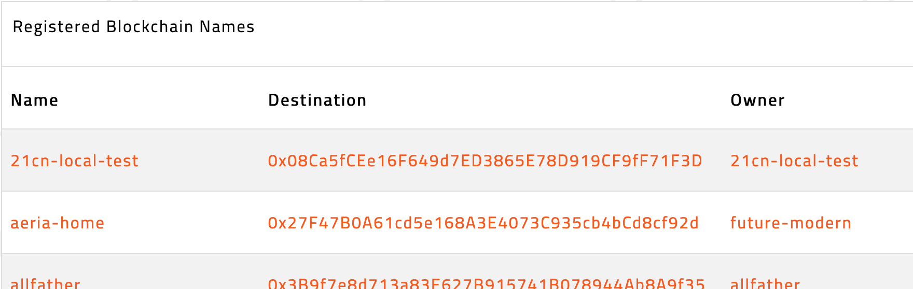

In an important step for evolving Web2.0 to Web3, Diode has released the ability to [map a Web2.0 domain to a Diode Web3 Client Address](https://support.diode.io/article/6pctb40wj8)!  This enables any Web3 publisher to publish content on a Web2.0 domain.  All 2, 3, and 4 letter [Top Level Domains](https://en.wikipedia.org/wiki/Top-level_domain) are supported.  Previous to this release, Web3 content could  be published only to other Web3 clients or via the https://{clientname}.diode.link Web2.0 subdomain.
  
This capability is important both today, and in the future:

### Today

This immediately enables all types of web hosting solutions without requiring a static IP address.  By creating a [Web3 host](https://support.diode.io/article/ss32engxlq-publish-your-local-webserver), your hosting hardware (anything from a Raspberry Pi under your desk, to your laptop on your desk, to a machine in a factory, to a full server in a datacenter) can be online from anywhere in the world without a static IP address, and can be accessed by a full Web2.0 domain name (e.g. www.acme.com). 

While we have found that hobbyists and web developers love this capability (it gives them easy capabilities to provide/roll-their-own web hosting services), it also immediately expands the IPv4 address space for hosting activities.  

### Future

Centralized Internet services like PKI and DNS, and the prevalence of IT admins with special access keys to nearly every level of the infrastructure, are significant challenges to Web2.0.  However, starting over is not an option - we have to find a way to "escape forward." This effort is necessary for the future of the Internet - and everyone from ["Winning Back the Internet"](https://roarmag.org/essays/win-back-the-internet/) [enthusiasts](https://news.ycombinator.com/item?id=25322834) to the geopolitical forces driving the very real [bifurcation of Internets](https://www.euronews.com/2020/09/11/splinter-net-is-the-internet-fracturing-along-geopolitical-lines-) see the need.  The centralization of the Internet creates [problems of governance and security](/burning-platform-pki/decentralized-pki-in-a-nutshell-19079/), but a graceful mechanism must be used to evolve into a less brittle, less corruptible system.  Diode's technology can provide the missing decentralization and governance required by Web3 - the next generation Internet.  This feature to support hosting Web3 content on current Web2.0 custom domains is a step in that direction.  

### Next Steps

With this capability, Diode has removed significant amounts of centralization from hosting activities, but has left the consumption/browsing Web2.0 ecosystem intact.  This progression is intentionally aligned with the more technical nature of early adopters - in this use case: those who setup websites or host content.  There are additional innovations required at the hosting infrastructure level to automate and leverage best-in-class hardware and connectivity, and we look to the Diode ecosystem to collaborate on moving these forward!

### How to Get Started?

It is easy to enable a Web2.0 domain to serve Web3 content - all that has to be done is to register the domain name (without the TLD) as a [BNS name](https://support.diode.io/article/5nsoxvhug1) and point a DNS A record to one of                            the Diode IPs. 

  
To setup your Web3 host with a custom Web2.0 domain, follow the guide at [https://support.diode.io/article/6pctb40wj8](https://support.diode.io/article/6pctb40wj8)!