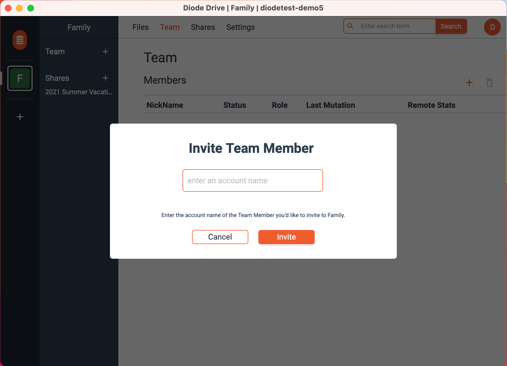

If you’re like me, you have a lot of devices.  I have my work computer, family laptop, family desktop, phone, tablet, as well as a few other devices.  My wife has several devices too, as do my teenage kids.  

I have tried different methods to keep all our files organized, accessible, and shareable.  Online options have file and storage size limits, I am never sure if my files are secure, and I have to provide “IT support” for my family members to ensure they have access to, and were using, the online service.  At one point I tried taking a large USB drive to each computer to do manual backups.  It was a chore but at least I knew where all my files were.  

Enter [Diode Drive](/solutions/app/) – it provides an elegant solution to these problems – it quietly synchronizes files from all our devices to a single secure destination using full end to end encryption.

For my Diode setup, I plugged a 1 Terabyte thumb drive into to a <a href="https://app.docs.diode.io/docs/">Raspberry Pi</a> as my “secure destination”.  I set up a Zone for work, a Zone for family, and also setup a few personal Zones for files and folders I didn’t need to share access with other people.  Then, invited members to the Zones: co-workers to my work Zone, and my wife and kids to my family Zone.  My work Zone makes it easily for me to share any size files and to collaborate with co-workers.  I use my family Zone so that my wife and kids can access photos and other documents.  Even if none of our laptops or phones or other devices are open and running, the Pi is always on, seamlessly serving and backing up files. 

With Diode I can finally access all my files from any device, all in one place!  Zones make it easy to organize the files and the team members who have access to them.  But perhaps most importantly, I have peace of mind knowing that even if something happens to my laptop, my files are always safely backed up in a safe location.
