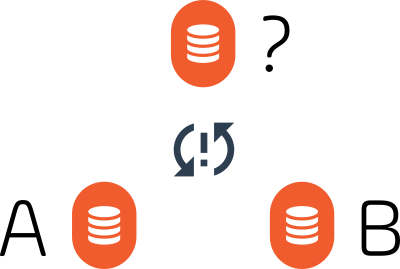
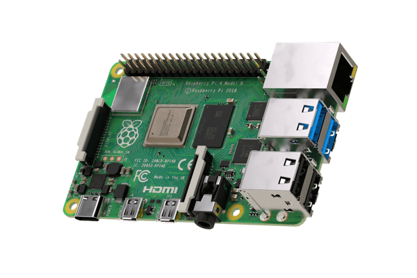
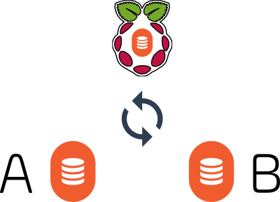

There are no inherently “cloud” components of Diode-based applications – they are decentralized systems, aggregating capabilities from the edge-connected participants. While that has many advantages (security, low-cost-of-maintenance, efficiency, accessibility), it means that some of the state persistence that centralized Web2 applications take for granted must be provided for differently in a pure [Web3 / Diode environment](/blockchain/Best-Resources-to-Learn-Web3-Blockchain-Decentralized-PKI-and-Ethereum-19262/).

In the case of [Diode Drive](/solutions/app/), if all Team Members in a Zone are just people using their phones and their computers, the overall state of the Zone may not be fully reflected in the aggregate of active participants at any given time. Take the situation, for example, in which there are just two Team Members who happen to be in different timezones – if Team Member A updates a file and then goes offline all while Team Member B’s computer is off, when Team Member B does come online, the file update will not be available. Since there are no centralized “always on” cloud components to the application, Team Members who pass like ships in the night may not get synchronized.

They need a third “Team Member” who is always online, and who can represent the state of the information to the other Team Member(s). Enter the humble [Raspberry Pi](https://www.raspberrypi.org/).
 

A Raspberry Pi is a low cost, reliable, and remotely manageable device that can play the role of this “always on” Team Member - we’ve found nearly everyone running a multi-team Zone can make use of a device, like a Raspberry Pi, to ensure file availability, perform seamless backups, and deliver on asynchronous communications. 

We recently posted an article that [describes how to configure a Raspberry Pi for this purpose](https://support.diode.io/article/ad7s45khyq).

These are early days in the deployment of Web3-based [Local First](https://www.inkandswitch.com/local-first.html) applications! The Raspberry Pi Team Member solution is a functional stop gap – it is not the end game. Its role as a regional, secure, and persistent peer is informing the evolution of Diode’s R&D as we work to make high security Web3-based collaboration even easier to use, and even easier to deploy, than traditional cloud based applications. 

