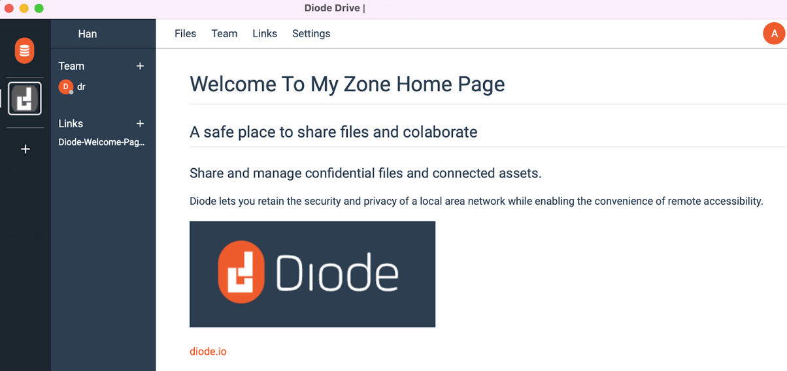

[Diode Collab](https://collab.diode.io/) is a file sharing and collaboration tool that works with Windows, MacOS, Linux (ARM and X86), Android, and iOS. It can be used to share a file or folder without sending the file or uploading it anywhere - regardless if the recipient also has Diode Collab installed or not. It can also be used to collaborate real-time with Team Members - friends, family, and co-workers who do have Diode Collab installed.

In addition to file sharing and collaboration, Diode Collab has “viewers” for certain file types, like picture and video files. Any file with a viewer can be viewed natively within Diode Collab, or via a browser (if web link enabled), without opening the file in another application. This is helpful, especially on mobile, where external applications may not be secure.

In version 1.3.11 (2021-12-28) and later, Diode Collab supports viewing Markdown (.md file extension) contents. Markdown allows you to add simple formatting elements to text documents (check out the <a href="https://app.docs.diode.io/docs/features/markdown-editing-basics/">Diode Drive Markdown Editing Basics guide</a>), while still maintaining readability of the text itself. 

This version also allows you to “promote” a Markdown document as your Zone’s home page. This gives you the ability to customize your Zone's introductory look and feel so that your team is oriented upon entering the Zone. Your home page can contain whatever you want it to contain - greetings, instructions, pictures, links to files and external articles, etc. For detailed instructions on setting up a home page for your Zone, checkout <a href="https://app.docs.diode.io/docs/using/create-a-home-page-for-your-zone/">Create a home page for your zone</a>.

This is an example Markdown document that could be used for a home page:

This is how it looks in Diode Collab:

We will be adding more native viewers and Markdown rendering functionality to Diode Collab in future updates. Connect with us on our Telegram channel for the latest updates and to join the discussion at [https://t.me/diode_chain](https://t.me/diode_chain).
