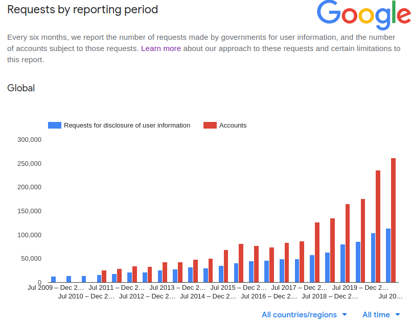
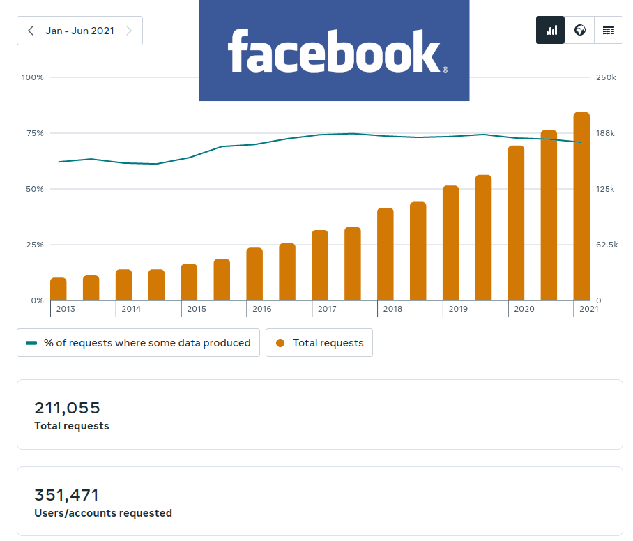

Self-Custody is a term coined by the Bitcoin movement and long-held as the future of finance. It's the ability to keep your account independent of a Bank, yet still more secure than ever before. When in [2015 the ATMs in Athens stopped giving out cash](https://www.bbc.com/news/business-33403008) to their citizens a shock went through Europe making it clear to everyone what a custodian bank account can mean.

## Why you should care about Self-Custody for data now

Self-custody for money is the seatbelt for your savings. You won't need it every day but in an incident such as the [2013 Cyprus Bank](https://www.theatlantic.com/business/archive/2013/03/everything-you-need-to-know-about-the-cyprus-bank-disaster/274096/) grab, it is showing its full value.

For data on the other hand we're not talking about big catastrophic one-off events but rather a slow erosion of user data integrity since the start of the cloud era. In the last six months of 2020 Google received requests for data from 261.238 user accounts. Over the whole of 2020 Google processed requests for 496.687 accounts alone.

What started with individual requests for data in emergencies turned rapidly into a self-service system for data retrieval. But it's not [Google](https://transparencyreport.google.com/user-data/overview?hl=en) alone, [Microsoft](https://www.microsoft.com/en-us/corporate-responsibility/law-enforcement-requests-report), [Facebook](https://transparency.fb.com/data/government-data-requests/), [Twitter](https://transparency.twitter.com/), [Dropbox](https://www.dropbox.com/transparency/reports) and [Apple](https://www.apple.com/legal/transparency/).

Facebook too is now processing requests for around half a million accounts yearly. Numbers growing quickly.

In addition to these explicit requests, the cloud providers are [scanning their user's content in ahead-of-time policing](https://www.infoworld.com/article/3115779/dont-trust-your-cloud-service-until-youve-read-the-terms.html). Sometimes these algorithms go wrong and (ban wrong documents)[https://uk.pcmag.com/old-cloud-file-storage-for-business/138342/google-drive-flags-text-files-containing-1-as-a-copyright-infringement]

Lawmakers are still in the progress of creating new regulations but the general direction is clear. *Data in the cloud does not enjoy the same legal protection that privately-held data has.* At the moment you are handing your data over to a cloud provider, you are reducing the privacy of your documents, files, and photos. In the worst case, it's not considered your exclusive content anymore.

## What Self-Custody for data means

To become a Self-Custodian for your data you have to hold and manage your cryptographic Wallet. Similar to a Bitcoin Wallet a data wallet keeps the private keys only which can be used to encrypt and decrypt your private data. Data is stored on machines you control and direct control is never out-sourced to cloud servers operated by 3rd parties. This way no 3rd party can ever scan or hand out your data even if they would like to or are compelled to. If anyone wants to see your data, they will have to request it from you directly.

## Diode Drive Desktop/Mobile Wallet

Diode Drive is the first Desktop and Mobile Wallet for Self-Custody of Data. With it, your Wallet keys are stored on your mobile phone or desktop computer. Data is only stored on the machines you control and encrypted using the keys when in transit.

With your Family, Organization, or Company you can create a shared Zone and share data without using any cloud provider and be assured that no one else can access your data, because only you hold the keys.

## What you need to know when using Data Wallets

This is a brave new world. But it also comes with new rules. Here are the most important pieces:

### Keep your Wallet private

Your Wallet contains your "private keys". These are the mathematical keys to your account and your data. Don't give anyone access to your private keys. Ever. Ever Ever. No one will ever have a good reason to ask you for your backup code or private keys. There is no third party, no service operator to whom you need to report.

*Every time* when someone asks you for your Wallet or your private keys assume that it is a scammer and do not engage.

### Store your backup code securely

Make an offline print-out of your Wallet backup code so you can restore access to your account after losing your phone, or when your computer fails. Again there is no third party that could assist you in restoring your account, so keep the backup safe and dry.

## So what holds you back?

It's now time to upgrade and move your data into your custody. Join us on this journey to explore what data freedom means. Go to our [download page](/download/) and try out Diode Drive today!

---

Connect with us on our Telegram channel for the latest updates and to join the discussion at [https://t.me/diode_chain](https://t.me/diode_chain).
