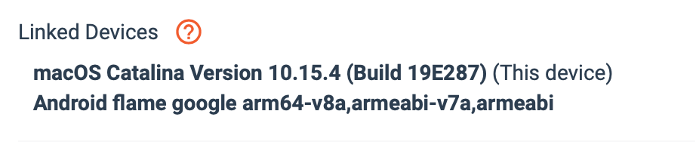
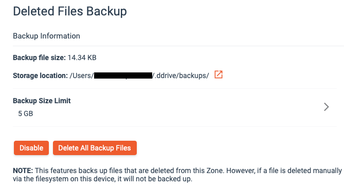

Diode Drive is a [self-custody solution for your information](https://diode.io/diode%20drive/self-custody-for-data-22032/). It gives you full control of who has access to your information and where it is stored - whether you are an individual or a company, you can use Diode Drive to maintain a secure information environment (e.g. HIPAA, GDPR, cross-geopolitical security, anti-scraping, de-google).

This post introduces recent new usability features: Linked Devices, Light Zones, and Deleted File Backups.

---

## Linked Devices

A Diode Drive user often needs to access their Account from more than one device – for example, from both their laptop and their phone. This is possible by adding additional devices as “[Linked Devices](https://support.diode.io/article/g3d42k5onu)” to an Account.

This capability is common in web applications, but since Diode Drive is a fully decentralized self-custodial solution (Diode has no access to your Account or your data), a key difference is that every user, upon signing up, should make sure to [save their Backup Code in a safe location](https://support.diode.io/article/l7noragxyj). 

## Light Zones

A Diode Drive Zone can be operated in [Light Zone](https://support.diode.io/article/e90ihyvxq6) mode wherein the Zone’s files are not always synchronized to the device. This is often the desired mode for computers or phones that need access to the Zone’s information, but don’t want to store all the Zone’s files on their local storage.

In the Zone Picker bar, Light Zones are depicted with a non-sync icon in the lower right portion of the Zone icon.

## Deleted File Backup

When a file is deleted from one Team Member’s device, the file is then deleted from everyone in the Zone. This is desired when the file is actually intended to be deleted, but can cause data loss if the deletion is accidental. As the number of Team Members grows in your Zone, the chances that someone will accidentally delete a file increases.

Diode Drive 1.4.10 and later allows a device to operate as a backup device by turning on the “[Deleted Files Backup](https://support.diode.io/article/4uxydawrq1)” setting. When a device has this setting, any files that are deleted by other Team Members will be backed up to a backup folder on the device. If a file was deleted accidentally, it can be restored from the backup device.

---

These are just a few of the recent new Diode Drive features - we hope you'll [try Diode Drive out](/download/) and use it to reclaim your information sovereignty!

