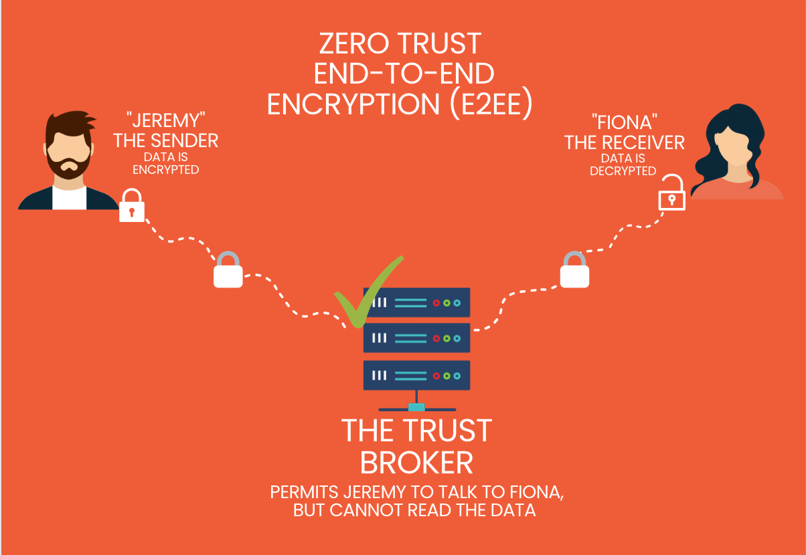
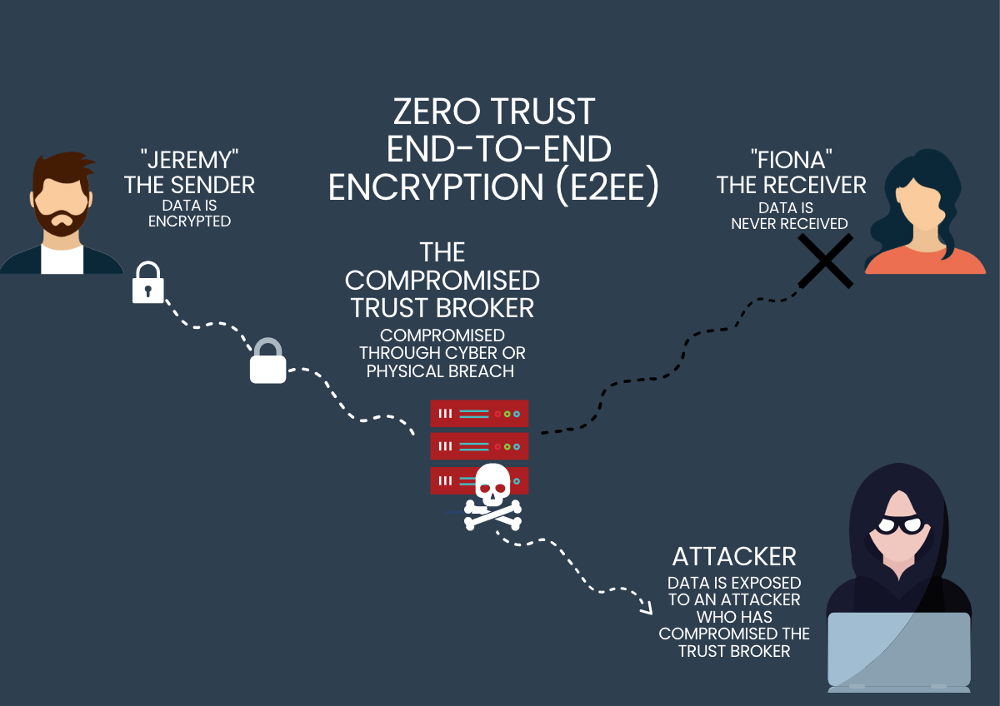

### Trust Brokers Make Zero Trust Possible

Zero Trust communications rely on secure communications between continuosly-validated parties.  In Zero Trust, the communications are often end-to-end encrypted (E2EE).  E2EE protects data by encrypting it with a key that is only known to the parties who would like to communicate. However, a universal challenge to establishing E2EE communications across the Internet is in establishing an initial connection between the two parties.  

Zero Trust introduces the concept of a Trust Broker to enable establishing connections, to ensure that connections are only made between authorized parties, and to keep communications session intact.  In order to do this, the Trust Broker maintains “Access Control Lists” that specify who can talk to who, and also handles metadata about the identities and connections.

A Zero Trust E2EE system is designed to look something like this:

**Encryption:** When Jeremy sends data using end-to-end encryption (E2EE), it gets encrypted from his device or browser using a unique encryption key that only he and Fiona know. This key transforms the content into an unreadable format, ensuring it remains unintelligible to potential interceptions.

**Transmission:** Jeremy sends the encrypted message to the Trust Broker, addressed to Fiona, through a communication channel, like the cloud. During this transmission, the Trust Broker, acting as an intermediary, verifies that the identities of both Jeremy and Fiona match those specified in the Access Control List.  If they do, it then relays the encrypted data to Fiona. 

**Decryption**: When Fiona receives the message, she decrypts it using the unique decryption key. This key unscrambles the content, restoring it to its original form and allows Fiona to read the message from Jeremy.

### The Importance of Trust Broker Security

Because of the central role that Trust Brokers play, Zero Trust networks require strong physical security and cyber security controls of the Trust Broker servers.  If there is insider threat (e.g. unreliable IT administrator or other staff) or digital/physical breach of the Trust Broker server, the Access Control Lists and connection integrity can be compromised.  A compromised Trust Broker can give an attacker access to sensitive information and expose potentially vulnerable devices and services - this can open the overall Zero Trust system up to [side channel attacks](https://en.wikipedia.org/wiki/Side-channel_attack).

When a Trust Broker is compromised, it can look something like this:

**Encryption:** When Jeremy sends data using end-to-end encryption (E2EE), it gets encrypted from his device or browser using a unique encryption key that only he and Fiona know. This key transforms the content into an unreadable format, ensuring it remains unintelligible to potential interceptions.

**Transmission:** Jeremy sends the encrypted message to the Trust Broker, addressed to Fiona, through a communication channel, like the cloud. However, the Trust Broker has been compromised: Instead of ensuring the message is sent only to Fiona, it sends the message and other meta data to the Attacker.  The Attacker uses the metadata to take advantage of other vulnerabilities in the Trust Broker, hacks the encrypted messages from Jeremy, and further exploits Jeremy’s misplaced trust in the connection to “Fiona”. 

**Decryption**: Fiona either never receives a message, receives false messages, or receives the same (but potentially compromised) messages in order to keep her in a state of ignorance that the Trust Broker has been compromised.

### Diode Secures the Trust Broker

Although the Trust Broker is core to the significant advantages to Zero Trust networks, it is also the network’s achilles heal.  Diode’s Zero Trust network solves this problem: Instead of requiring advanced physical and cyber security for the Trust Broker servers, Diode mathematically secures the Trust Broker.  This eliminates the key vulnerabilities that exist in traditional Zero Trust network infrastructure, making all the benefits of Zero Trust communications accessible to many new markets and uses cases.

You can experience the difference by using Diode ([Diode App](https://diode.io/#download-app) or [Diode CLI](https://diode.io/#download-cli)) today to keep your fast moving teams secure.
