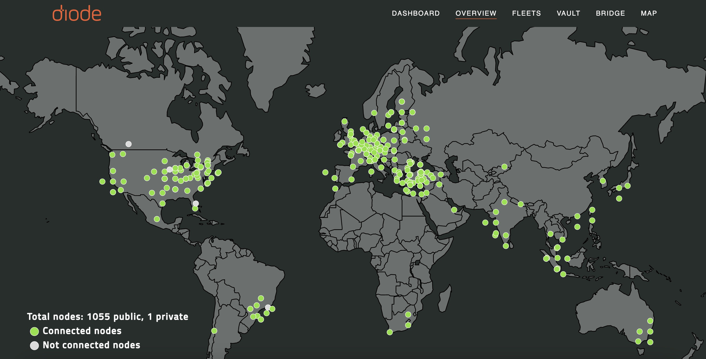

The Diode Network is a Web3 Zero Trust Network - a Decentralized Physical Infrastructure Network (DePIN) that enables trustless, secure, and private communication using a cutting-edge technology called [Zero Trust Networking](https://diode.io/blog/open-approach-to-ztna) (ZTN aka ZTNA). ZTN is rapidly replacing VPN as the go-to method for secure communication. Unlike VPN, ZTN is continuously validated to ensure distributed team members and work sites can stay connected without introducing undue risk to the organization. 

ZTN will soon become the predominant method for secure communication - several governments, military arms, and commercial sectors are already adopting it. However, today's ZTN implementations have significant drawbacks in the areas of security, cross-account device credentials, vendor lock-in, and limited regional scope.  By bringing ZTN to the blockchain, Diode mitigates these issues and paves the way to bring ZTNA to the masses.  Diode is the innovation leader in Web3 Zero Trust Networks, supporting novel DePIN use cases - such as SaaS applications (our [Diode Collab product](https://diode.io/products/collab) is a native zero-trust messaging app) that use native zero-trust security.  

## **Web3 Zero Trust Networks (Web3 ZTNA)**

### **Problems solved by Web3 Zero Trust Networks (Web3 ZTNA)**

Zero Trust networking requires a Trust Broker, but traditional [Trust Brokers have many single point of failure vulnerabilitites](https://diode.io/blog/trust-broker-security). Diode's Web3 [Zero Trust Network](https://diode.io/blog/open-approach-to-ztna) (Web3 ZTNA) can solve all of these drawbacks by leveraging mathematical security through a combination of blockchain smart contracts and network validation algorithms.  This eliminates the need for the stringent physical security requirements that make traditional Trust Brokers costly and regionally scarce.

In our article "[The Need for an Open Architecture Approach to Zero Trust Networks (ZTNA),](https://diode.io/blog/open-approach-to-ztna)" we highlighted how Web3 Zero Trust Networks can improve flexibility, interoperability, and security in multi-cloud and hybrid environments. This approach ensures seamless integration with various technologies, prevents vendor lock-in, and enhances security with blockchain integration to protect against insider threats and social engineering. An open and permissionless approach to Web3 ZTNA also makes these benefits accessible to organizations of all sizes through a diverse, extensible, and affordable environment.

### **Additional Advantages of Web3 Zero Trust Network (Web3 ZTNA)**

In addition to creating the solutions listed above, Web3 Zero Trust Networks introduce new and integrated solutions for: 

*   **Self-Custody Identities:** A verified system-wide identity is required for each user to access any information. This identity must be recognized, authenticated, and then compared to the access control policies. In Diode’s case, a unique backup key is generated for each user’s profile. 
*   **Global Routing:** The solution enhances global routing by verifying user identities, device security, network isolation, and data access policies, ensuring that only authorized entities can route sensitive data across regions.
*   **Massively Distributed PoPs:** Enforces identity verification, device validation, network isolation, and strict data access policies, ensuring that only authorized users and devices can connect to and interact with resources at each Point of Presence (PoP).
*   **SaaS App Support:** Leveraging blockchain-based smart contracts to automate provisioning and ensure trustless security. These systems allow applications to function seamlessly in highly secure, air-gapped environments, offering enhanced protection against unauthorized access and data breaches while maintaining the ease of use expected from SaaS products.
*   **Integrated Payments:** Continuous verification of every access request and limiting access to only authorized users, significantly reducing the risk of unauthorized transactions, data breaches, and cyber threats in payment gateways.

## **Diode is Leading Web3 Zero Trust Network Innovation**

Soon after the launch of our Web3 ZTNA Relay Node, in November 2024, over fifty public nodes were providing permissionless Web3 ZTNA services.  Diode's Web3 ZTNA community leverages the fundmentals of Web3 DEPIN to drive global expansion, as more individuals and entities become node runners. Diode Relay Nodes are easy to run - anyone with a medium level of computer sophistication can run one and help the world take a step closer to transforming the Internet into everyone’s private network. 

Nodes are permissionless - anyone can run them.  New nodes come online frequently, extending Diode's availability into more regions through new global communication points. Recent locations like Santiago de Querétaro, Doha, Taiwan, Sogndal, and more, enhance secure in-theatre connections while enabling communication with the rest of the world. The best part? You can set it up in [under 3 minutes](https://www.youtube.com/watch?v=Klh6KK_wNAM&t=8s). 

[Set up a Diode node](https://network.docs.diode.io/docs/) today and be a part of transforming the Internet into everyone's private network. 

## **Diode and Zero Trust**

Diode has implemented the [pillars of Web3 Zero Trust Networks](https://diode.io/blog/pillars-of-zero-trust) across its systems, ensuring that all users within the ecosystem are verified and secure, leaving no room for data misuse or leaks. Diode has even gone a step further into offering [a more secure altnernative to VPN](https://diode.io/blog/does-vpn-protect-my-information) known as [ZTN (Zero Trust Network)](https://app.docs.diode.io/docs/features/regional-tunnels/), which democratizes consumer VPN usage by making it easy for anyone to contribute VPN exit nodes. 

By adopting Diode’s technology, you’re not just securing your data - you are helping to redefine the future of the Internet into a private, trustless, and decentralized network for everyone. Don’t miss out on the future of security—take control and help build the next generation of the Internet.

To explore further please:

  <a href="{{"https://contactdiode.paperform.co"}}" class="btn" target="">Get in Touch</a>
  <a href="#download-app" class="btn popup-open" target="">Try Diode Out</a>

