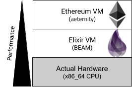
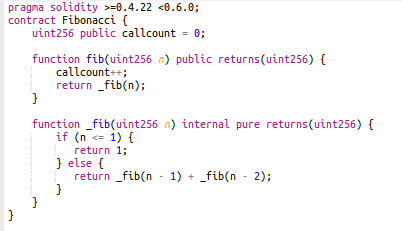
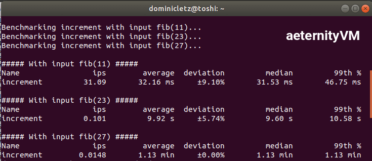
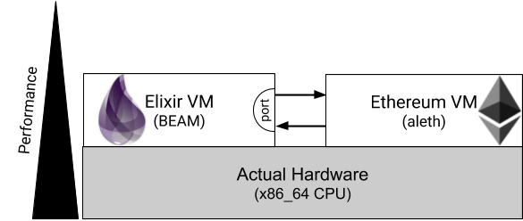
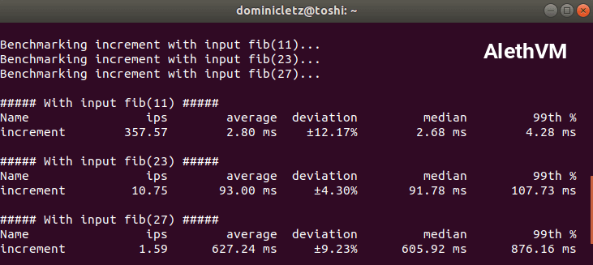
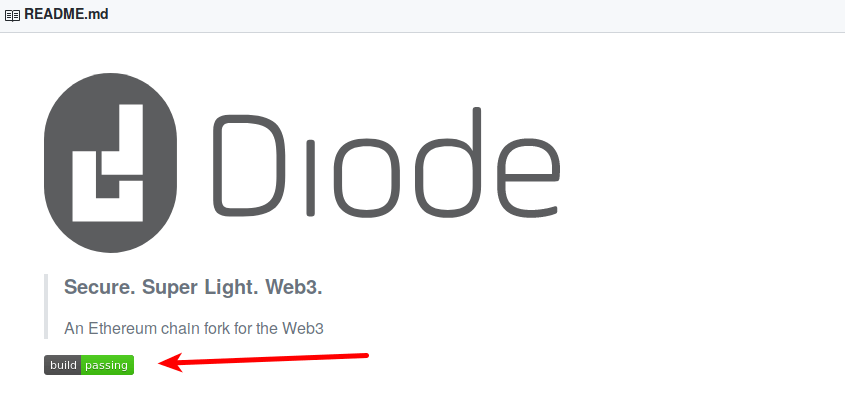

[Diode](https://diode.io/), at its core, is a finality gadget with an [Ethereum](https://www.ethereum.org/) block header change. It’s enabled by a [super-light protocol and client](/blockchain/how-blockquick-super-light-client-protocol-can-help-mitigate-eclipse-attacks-19161/) for [constrained devices](/iot/hardware-requirements-of-blockchain-clients-19196/), allowing them to read contract state data and validate the corresponding merkle proofs. The finality gadget and algorithm are based on [BlockQuick](https://eprint.iacr.org/2019/579.pdf). View the Diode project on [Github](https://github.com/diodechain). In this blog post, we take a look back at the past few months and a look ahead to the plans for the coming months.

It has been a very busy few months for the Diode team. There is a lot happening in the world of blockchain. The first week of October, we went to [Devcon](https://devcon.org/), the largest Ethereum developer-focused conference in the blockchain community which took place in Osaka, Japan. CTO [Dominic Letz](https://twitter.com/dominicletz) took the opportunity to [discuss](/devcon/Diode-Osaka-Devcon-V-Recap-19298/) the challenges in realizing the [Web3](https://blockchainhub.net/web3-decentralized-web/) vision to achieve a fully distributed web on Day 3 at Devcon.

In mid October, a few of us attended [Crosslink 2019](https://crosslink.taipei/), a 2-day Ethereum conference organized by [Taipei Ethereum Meetup](https://www.meetup.com/Taipei-Ethereum-Meetup/) community, in New Taipei City, Taiwan. The lineup of impressive speakers and researchers such as Ethereum creator [Vitalik Buterin](https://vitalik.ca/) and [Protocol Labs](https://libp2p.io/) the libp2p project tech lead [Raúl Kripalani](https://github.com/raulk) generously shared their knowledge and expertise with the local community. We were honored to be able to take part in this amazing event!

## Roadmap Update

### In Progress

#### Web3, Web3, Web3 (aka Firefox Plugin)

Currently, we are working on developing Firefox browser plugins in order to allow more users to be able to access the first Web3 Network Diode. Our goal is to make the system easily accessible to website providers, makers, hackers, and the general public. It will be able to support a wide range of devices including Arduino, Raspberry Pi and ESP32, as well as general website servers at your home or a data center. We want to empower users to build the decentralized web. It will have a lot of potential for both IoT devices as well as for people, as it offers a new way for web content to be published and consumed anywhere server-less. 

### Highlights of what we have achieved over the past few months

#### 100x Faster EVM

Most notably, we replaced the Ethereum Virtual Machine (EVM for short) that we borrowed from [aeternity](https://github.com/aeternity/aeternity/tree/master/apps/aevm/src) in our codebase with the official EVM from the [aleth project formerly known as cpp-ethereum](https://github.com/ethereum/aleth/blob/master/libaleth-interpreter/).

The Diode server software is written in [Elixir](https://elixir-lang.org/), a functional language, and we found great resources around Ethereum development including an EVM implementation written in Erlang created by the [aeternity team](https://aeternity.com). While we had a great start with the aeternity EVM, we soon had to realize that it wasn’t [100% compatible](https://github.com/aeternity/aeternity/issues/2497) with the official EVM and as turned out, it probably never would be. We kept the source tree though and fixed issues as we came across them. It was sad to be not 100% compatible but not a show stopper at that point.

But running our prenet and scaling up transaction processing last month we ran into another **bigger** problem. When running blocks with ~100 transactions, we saw that the block validation times skyrocketed. Instead of a few milliseconds, it was now taking 5 seconds and more to validate a block. Running profiling, we saw that most of the time was spent in the EVM crunching numbers. Elixir itself is running on a virtual machine called [BEAM](https://en.wikipedia.org/wiki/BEAM_(Erlang_virtual_machine)) and the Ethereum VM now on top of that. Having had some experience with [performance of low-level cryptographic functions written Elixir](https://elixirforum.com/t/ex-sha3-pure-elixir-implementation-of-sha3-and-keccak-1600-f/21943/8), we conducted a closer analysis. 

To focus purely on the CPU bound performance of the EVM, we constructed a new smart contract with one of our favorite functions. The very slow recursive Fibonacci implementation. In the Fibonacci function, each number is the sum of its two predecessors, starting in our case with 1, 1 and then continuing 2, 3, 5, 8 and so forth.

Here in solidity code implemented recursively:

There are much more efficient ways to calculate Fibonacci, but in this case we wanted to measure the opposite. We wanted to measure how large the amount of function calls and calculations would perform on our EVM.

Using [Elixir’s Benchee](https://github.com/bencheeorg/benchee) tool and the test code that you can still find in [this branch](https://github.com/diodechain/diode_server_ex/tree/aevm_benchmark), we ran a reference profile of the aeternityVM to calculate the Fibonacci numbers with this contract for fib(11), 23 and 27. 

At fib(11), a 32ms execution time seems slow but still manageable. But looking at fib(23), it’s already 10 seconds, and fib(27) takes more than a minute. The gas cost for calculating fib(27) with this would be 25,773,281, which is 2.5x more than the current block gas limit of 10 million. But taking this max of 10 million and dividing the 73 seconds total time it took by 2.5x, we concluded that in the worst case, validating a block with 10 million gas would take 73/2.5, which is 29 seconds. This is way above the 15 seconds block time goal and thus totally unacceptable. In fact, the block validation needs to take much less time ~200ms so that most of the seconds block time can be used on creating new blocks and solving the PoW problem. For that we needed 100x times faster execution times. We knew we needed a new EVM.

**EVMC and Erlang Port Communication**

Luckily there are [plenty of Ethereum VMs](https://github.com/ethereum/wiki/wiki/Ethereum-Virtual-Machine-(EVM)-Awesome-List) available. This time we wanted to pick one that is not only faster but also 100% compatible, and one that will be maintained in the future. Aleth formerly known as [cpp-ethereum](https://github.com/ethereum/cpp-ethereum/blob/develop/libevm/VM.cpp) is the reference that is used to generate the consensus test suite. It is also one of the EVMs that support the generalized C interface for EVMs called [EVMC](https://evmc.ethereum.org/). This would allow us to switch to different versions of the EVM quicker or even make them pluggable.

In Elixir there are two primary ways to communicate with C applications, Ports and Nifs. Ports are external applications that run on their own, as independent operating system processes. This ensures that crashes in those C applications can not impact the Elixir VM, but comes at a higher communication cost since the C application is running in a different OS process.

With this new setup, we re-ran the same benchmark to finally measure the reward of all of this effort.

And indeed we found that this time we were looking at very different performance numbers. While for fib(11) the difference in performance is already 11x, when running the larger computations for fib(23) and fib(27) the performance difference went up to 117x.

<table>
  <tr>
   <th></th>
   <th>aeternityVM runtime</th>
   <th>AlethVM runtime</th>
   <th>Improvement</th>
  </tr>
  <tr>
   <th>fib(11)</th>
   <td>32ms</td>
   <td>3ms</td>
   <td>11x</td>
  </tr>
  <tr>
   <th>fib(23)</th>
   <td>9,920ms</td>
   <td>93ms</td>
   <td>107x</td>
  </tr>
  <tr>
   <th>fib(27)</th>
   <td>73,000ms</td>
   <td>627ms</td>
   <td>116x</td>
  </tr>
</table>

We believe that these differences between `fib(11)` and fib(23)/fib(27) in improvements are because of the communication overhead between Elixir and external AlethVM. The amount of time that is spent in the logistics of making an inter-process call from Elixir to Aleth is a certain fixed cost that seems to be affecting the call time of fib(11). In the future we might investigate this further and improve for these small calls.

For now we’re pretty happy to have a fully compatible and much faster EVM. Using the same estimation of how long a CPU heavy 10 million gas transaction would take to validate now we get 627ms / 2.5x = **250ms**. In the future, it might be great to extract this EVM interface and make it available as a library to the greater Elixir community. If you feel like this is something you would like to do, check out [our current wrapper](https://github.com/diodechain/diode_server_ex/blob/master/lib/evm.ex).

#### Data Interfaces EIP-2330

Just this week we filed an Ethereum Improvement Proposal (EIP) for a new EVM opcode _EXTSLOAD_ and connected updates to Solidity. These extensions we believe are crucial to make decentralized infrastructure accessible on very small IoT devices. Currently the Ethereum ecosystem assumes that each participant can validate the chain and is running a compatible EVM. With [BlockQuick](https://eprint.iacr.org/2019/579.pdf), we allowed tiny devices to identify the authoritative Ethereum chain, and with this improvement small devices would be able to read information such as for ENS from the chain directly. If you curious to learn more [read the EIP here](https://dominicletz.github.io/EIPs/EIPS/eip-2330) and [join the discussion](https://ethereum-magicians.org/t/eip-2330-sload2-and-abi-for-lower-gas-cost-and-off-chain-apps/3733).

* EIP-2330: [https://dominicletz.github.io/EIPs/EIPS/eip-2330](https://dominicletz.github.io/EIPs/EIPS/eip-2330)
* Solidity-7593: [https://github.com/ethereum/solidity/issues/7593](https://github.com/ethereum/solidity/issues/7593)
* Discussion: [https://ethereum-magicians.org/t/eip-2330-sload2-and-abi-for-lower-gas-cost-and-off-chain-apps/3733](https://ethereum-magicians.org/t/eip-2330-sload2-and-abi-for-lower-gas-cost-and-off-chain-apps/3733)

#### TravisCI

Last but not least, we finally enabled continuous testing for our [server implementation](https://github.com/diodechain/diode_server_ex). We initially had some problems getting Travis to run the most recent software versions until we realized that Travis does not yet support Ubuntu 18.04 for Elixir as one of their build options, and had to do some work-arounds in our [travis.yml](https://github.com/diodechain/diode_server_ex/blob/master/.travis.yml) to use a recent C++ compiler for our new AlethVM. We are full believers in continuous automated testing and will keep rolling this out to other tools as well in the future. Until then enjoy the green build flag on our repository:

